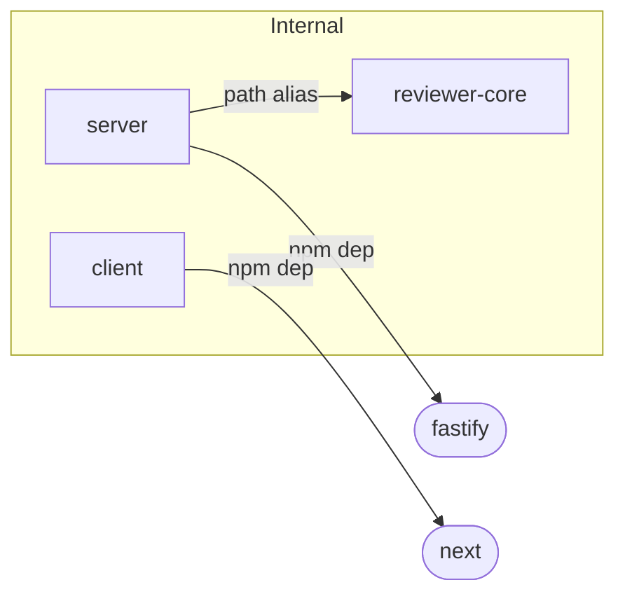

# Dependency Checker

Audit every package's npm dependencies and internal cross-package imports, then deliver one structured report: scope, Mermaid graph, size breakdown, prioritized findings, and concrete recommendations. Never fabricate sizes or version numbers — only report what you actually read or measured.

---

## Report Structure

Every output MUST follow these five sections in order. Do not skip, rename, or merge sections.

### Section 1 — Scope

Bullet-list every package analyzed (e.g. `server`, `client`, `reviewer-core`, `e2e`). State what was inspected: `package.json` entries, installed sizes, and cross-package import patterns.

### Section 2 — Dependency Graph

Emit a `flowchart LR` Mermaid diagram inside a triple-backtick `mermaid` fence. Rules:

- Internal packages → rectangle nodes: `id[label]`
- External npm packages → rounded nodes: `id([label])`
- Edge labels describe the relationship: `-->|npm dep|`, `-->|path alias|`, `-->|relative import|`
- Group internal packages in a `subgraph Internal` block
- Keep total node count ≤ 25; if more, show only the top 10 by installed size
- Node IDs must be alphanumeric — replace `-` and `/` with camelCase (e.g. `reviewerCore` not `reviewer-core`)

Example structure:



### Section 3 — Size Breakdown

Render a markdown table with these exact columns:

| Package | Dependency | Installed Size | Notes |
|---------|------------|---------------|-------|

- Sort by installed size descending
- Mark with `⚠ possibly unused` any runtime dependency not found in any import under `<package>/src/`
- Mark with `⚠ version drift` any dependency declared in multiple packages with mismatched semver
- Include both `dependencies` and `devDependencies` — label devDeps explicitly in Notes

### Section 4 — Findings & Priorities

Group every finding under a severity tier. Each finding MUST name a specific package, file, or version — never write generic advice like "consider optimizing dependencies."

| Tier | When to use |
|------|-------------|
| **P0 — Critical** | Unused runtime dep confirmed by grep; non-public cross-package import (direct `src/` path bypassing the package's entry point) |
| **P1 — High** | Same package at different semver across packages; dev-only dep listed under `dependencies` instead of `devDependencies`; installed size > 50 MB for a dev/test-only package |
| **P2 — Medium** | Outdated major version with known deprecations; missing peer dependency |
| **Info** | Patch-level version drift; style notes |

Format:

```
#### P0 — Critical

- **[moment] unused in server** — declared in `server/package.json` but zero files under `server/src/` import it. Recommendation: run `npm uninstall moment` inside `server/` (confirm first).

#### P1 — High

- **[zod] version drift** — `server` declares `3.23.8`, `client` declares `3.22.4`, `reviewer-core` declares `3.23.8`. Pin all three to the same version.
```

Omit any tier that has no findings — do not write "P2: none."

### Section 5 — Summary

3–5 bullet points ordered by priority. Each must reference a specific file or package name. Present removals and structural changes as recommendations to confirm, not actions already taken.

Example:

> 1. **Remove `moment` from `server/package.json`** — saves 4.2 MB, zero imports found. Confirm and run `npm uninstall moment` in `server/`.
> 2. **Fix `reviewer-core` import** in `server/src/services/review-service.ts` — import through the public entry point, not the internal `src/pipeline.js` path.
> 3. **Align `zod` versions** across `server`, `client`, and `reviewer-core` to `3.23.8`.

---

## Data Collection Protocol

When running with tool access, gather data in this order before writing the report:

1. **Discover packages**: `find . -name package.json -not -path "*/node_modules/*" -not -path "*/.next/*"`
2. **Read each `package.json`**: extract `name`, `dependencies`, `devDependencies`
3. **Measure installed sizes**: `du -sh <pkg>/node_modules/<dep>` for each declared dependency
4. **Check for unused deps**: `grep -r "import.*<dep>" <pkg>/src/` — zero hits on a runtime dep → flag as `⚠ possibly unused`
5. **Surface internal imports**: `grep -r "@shared\|from.*\.\.\/" <pkg>/src/` to find cross-package path-alias and relative usage
6. **Check entry points**: flag any import that references another internal package's `src/` directory directly (e.g. `reviewer-core/src/pipeline.js`) instead of its declared package entry point

---

## Internal vs. External Dependencies

This project is NOT a pnpm/npm workspace monorepo — packages share code via TypeScript path aliases and direct relative imports, not `workspace:*` links. Always make this distinction explicit in the report:

- **External npm dependency** — declared in `package.json`, installed in `node_modules`
- **Internal path-alias dependency** — cross-package import via a TypeScript alias like `@shared/review-types`; does not appear in `package.json`
- **Internal relative import** — direct relative path crossing a package boundary (e.g. `../../reviewer-core/src/pipeline.js`); a P0 finding when it bypasses the target package's public entry point

Never claim the packages are linked via `workspace:*` or pnpm workspaces.

---

## Severity Quick Reference

| Signal | Tier |
|--------|------|
| Unused runtime dep (grep confirms zero imports in `src/`) | P0 |
| Cross-package import bypassing public entry point | P0 |
| Same dep at different semver across packages | P1 |
| Runtime dep that should be `devDependencies` | P1 |
| Dev/test-only package with installed size > 50 MB | P1 |
| Outdated major version | P2 |
| Missing peer dependency | P2 |
| Patch-level version drift | Info |

---

## Output Quality Gates

Before emitting the final report, verify:

- [ ] All five sections are present and in order
- [ ] The Mermaid block uses `flowchart` (not `graph`) and all node IDs are alphanumeric
- [ ] The size table has all four columns and is sorted descending by size
- [ ] Every P0/P1 finding names a specific file or package — no generic statements
- [ ] Summary has 3–5 items referencing specific packages or files
- [ ] Removals are framed as recommendations, not completed actions
