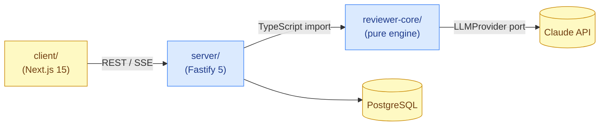

# doc-writer

Authoring skill for `dev-digest`. Produces docs that mirror working code —
never ahead of it — and places them in the right repo location the first time.

## 1. Diátaxis type selection

Pick **one** type per document. Never mix two types in the same file.

| Type | Purpose | Key signal |
|---|---|---|
| **Reference** | Describe what already exists — API surface, config keys, CLI flags, schema fields. Neutral tone; mirrors the code exactly. | "What is X?" "What are the params?" |
| **How-to** | Convert a plan or walkthrough into numbered steps toward a concrete goal. Assumes competence; skips theory. | "How do I do X?" "Turn this plan into steps." |
| **Explanation** | Articulate why a decision was made, trade-offs, alternatives discarded. No steps; no API lists. | "Why did we…?" "What's the trade-off between…?" |
| **Tutorial** | Learning-oriented walkthrough with a safe sandbox outcome. Rare in this codebase; check existing docs first. | "Teach me X from scratch." |

Use the **(action vs theory) × (learning vs applying)** compass:

```
           LEARNING
              │
   Tutorial ──┼── Explanation
              │
 DOING ───────┼─────────── THEORY
              │
   How-to  ───┼── Reference
              │
           APPLYING
```

When in doubt between Reference and How-to: if the reader needs to *do*
something, it is How-to. If they need to *look something up*, it is Reference.

## 2. Repo doc placement

Scan `docs/` and the target module before writing to avoid duplicates.
Use **kebab-case** filenames throughout. Update docs in the same PR as
the code change — prefer fresh+small over large+stale.

| Doc kind | Exact location in this repo | Notes |
|---|---|---|
| Repo-wide orientation, architecture overview, setup | `README.md` (root) | Already exists; update the relevant section, don't create a second orientation file. |
| Module orientation, API map, env vars, boot semantics | `<module>/README.md` (e.g. `server/README.md`, `client/README.md`) | Per-module; update in place. |
| "How we write code here" conventions for a module | `<module>/AGENTS.md` | Add a section; don't replace the whole file. |
| Durable, non-obvious surprise / lesson | `<module>/INSIGHTS.md` (or root `INSIGHTS.md`) | Defer to the `engineering-insights` skill — do not write INSIGHTS entries directly. |
| Deep dive that doesn't fit one module README | `docs/<topic>.md` | Currently only `docs/agent-prompts/`. Scan `docs/` first. Use a flat file unless the topic is large enough to warrant a sub-dir. |
| AI reviewer prompt edits | `docs/agent-prompts/<name>.md` | Four reviewers already exist (`general-reviewer.md`, `security-reviewer.md`, `performance-reviewer.md`, `test-quality-reviewer.md`). Edit in place; add a new file only for a new reviewer. |
| Implementation / Development Plan | `docs/plans/<feature>.md` | Verified by the `plan-verifier` skill. Do not convert plans to docs — plans stay as plans; the outcome is the module README/How-to doc. |
| Architecture Decision Record | `docs/adr/NNNN-<kebab-title>.md` | `docs/adr/` does not exist yet — **create the convention** when writing the first ADR. Zero-pad to four digits (e.g. `0001-choose-drizzle.md`). Follow the MADR template (see `references.md`). |
| Contract / DTO / shared fixture | `<module>/specs/` (e.g. `client/specs/`, `server/specs/`) | All four modules have a `specs/` dir; place the file in the module that owns the contract. |

### Placement decision flowchart

```
Is it a durable non-obvious surprise?
  → INSIGHTS.md via engineering-insights (not this skill)

Does it span the whole repo / explain the overall architecture?
  → README.md (root) or docs/<topic>.md

Is it module-specific orientation / API / env?
  → <module>/README.md

Is it an immutable architecture decision with rationale?
  → docs/adr/NNNN-<title>.md (create docs/adr/ if first ADR)

Is it a contract or shared fixture?
  → <module>/specs/

Is it an AI reviewer prompt?
  → docs/agent-prompts/<name>.md

None of the above?
  → scan docs/ first, then create docs/<topic>.md
```

## 3. Mermaid integration

For syntax, node shapes, arrow types, sequenceDiagram notation, erDiagram
cardinality, state transitions, and `classDef` theming, **read the
`mermaid-diagram` skill** at `.claude/skills/mermaid-diagram/SKILL.md`. Do not
re-teach syntax here.

### Diagram-type → purpose map

| Diagram type | Mermaid keyword | Best used for in this repo |
|---|---|---|
| Flowchart | `flowchart TD` / `LR` | Skill/agent procedure steps, data pipeline decisions, request-handling flow |
| Sequence | `sequenceDiagram` | Client ↔ Server ↔ LLM API call chain, Fastify plugin lifecycle, SSE flow |
| ER Diagram | `erDiagram` | Drizzle schema relationships (tables, FK links) |
| Class Diagram | `classDiagram` | TypeScript type hierarchy, port/adapter relationships, `@devdigest/shared` contracts |
| State Diagram | `stateDiagram-v2` | Review run lifecycle (queued → running → completed/failed), auth state machine |
| C4 Context | `C4Context` | High-level system context (four packages + external services) |
| C4 Container | `C4Container` | Inter-package interaction (server ↔ reviewer-core ↔ client ↔ GitHub) |

### Embedding rule

Every diagram in a doc file must follow this pattern:

1. A `## <Section>` heading or `### <Subsection>` that names what is shown.
2. A fenced ` ```mermaid ` block containing the diagram.
3. A **caption paragraph** of 2–4 sentences: state what the diagram shows,
   the key insight a reader should take away, and any caveat (e.g. "dashed
   arrows are optional paths"). The caption lives *below* the fence.

Use `classDef` for visual grouping instead of per-node `style` — `classDef`
is composable and survives theme changes. Example:



The four packages of `dev-digest` and their communication paths. `client/`
calls `server/` over HTTP/SSE. `server/` imports `reviewer-core/` as TypeScript
source (no publish/emit step) and passes a concrete `LLMProvider` adapter at
runtime. `reviewer-core/` never reads `process.env` — all config arrives via
arguments.

## 4. Document only what's in the code

These rules prevent documentation drift and hallucination.

**Do document:**
- The public contract: exported function signatures, API route paths, Zod
  schema fields, config keys that are read in the code.
- Behavior that is non-obvious from the code alone (e.g. "this endpoint
  is workspace-scoped; the caller must include a valid session cookie").
- Preconditions, constraints, and error conditions that the implementation
  actually enforces.

**Do NOT document:**
- APIs, params, or behaviors that are planned but not yet implemented.
- Implementation details that are obvious from reading the code (e.g.
  "this function iterates over the array").
- FAQs you invented to pad the doc.
- Anything you cannot keep current: if updating the doc requires reading
  >3 files, it is probably too coupled to implementation details.

**One term per concept.** If the codebase calls it `workspaceId`, the doc
calls it `workspaceId` — not "workspace identifier", "tenant id", or "org id".

**Explicit heading hierarchy.** `#` for the doc title, `##` for major
sections, `###` for sub-sections. Never skip a level. Never use bold text
as a substitute heading.

**Document the contract, not the implementation.** A consumer needs to know:
what to pass in, what they get back, what errors to handle, what side effects
occur. They do not need to know which Drizzle query runs internally.

## 5. Output contract

For each document produced:

1. Write the file at the path determined by §2 (correct Diátaxis type +
   correct repo location).
2. Include at least one Mermaid diagram (with caption) when the content
   involves a data flow, service interaction, lifecycle, or schema — skip
   diagrams only for pure reference pages with no flow to illustrate.
3. Add a one-line placement note at the top of your response (not in the
   doc file itself):

   > **Placed at** `docs/<topic>.md` — **Why**: cross-module deep dive
   > (server + reviewer-core), too broad for either module README; no
   > existing file covers this topic.

4. If the doc updates an existing file, show what section changed and why
   the adjacent sections were left untouched.

## 6. Language

Write the **doc content in English**. Report and explanations to the user
in **Ukrainian**.

---

## Based on

See `references.md` for the full source list (Diátaxis, Google doc guides,
ADR/MADR, Mermaid, C4, LLM-friendly docs, Write the Docs, Claude Code skills).
