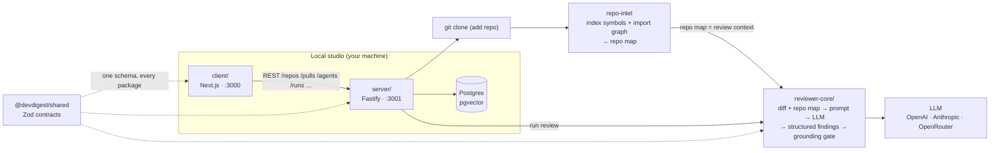

# DevDigest — starter

Local-first AI pull-request review. This is the **course starter template**: a
minimal-but-working tool that does exactly one thing end to end — **import a PR
and run an agent review on it**. Every later course lesson adds one feature back
(see [_What you build in the course_](#what-you-build-in-the-course)).

Several standalone packages (no monorepo workspace — each has its own
`package.json` and lockfile; cross-package code is shared through tsconfig path
aliases, not published modules):

| Folder           | Package                     | What it is                                            | Port      |
|------------------|-----------------------------|-------------------------------------------------------|-----------|
| `server/`        | `@devdigest/api`            | Fastify API + Drizzle/Postgres (pgvector)             | 3001      |
| `client/`        | `@devdigest/web`            | Next.js 15 web app (the studio)                       | 3000      |
| `reviewer-core/` | `@devdigest/reviewer-core`  | Pure review engine: diff → prompt → LLM → findings    | —         |
| `e2e/`           | `@devdigest/e2e`            | Deterministic browser e2e (agent-browser)             | —         |
| `mcp/`           | `@devdigest/mcp`            | Local stdio MCP adapter over the API (5 tools)        | — (stdio) |
| `server/src/vendor/shared` | `@devdigest/shared` | Zod contracts shared across every package             | —         |

`repo-intel` (the codebase indexer that powers the **Indexed** badge and feeds
project context into reviews) lives inside the server at
[`server/src/modules/repo-intel`](server/src/modules/repo-intel). Only
**Postgres** runs in Docker; the API and web app run on the host via `pnpm dev`.

## Architecture



The review flow end to end: **add a repo** → server clones it and `repo-intel`
indexes it (the **Indexed** badge) → **import PRs** from GitHub → open a PR and
**Review** → `reviewer-core` assembles a prompt from the diff + the repo map,
calls the LLM, validates every finding against the diff (the **grounding gate**
drops hallucinated line references), and persists structured findings with a
severity and score. All local; the only outbound calls are to GitHub (PR data)
and the LLM (via OpenRouter).

Each package has its own README with deeper diagrams:
[`client`](client/README.md) (UI route map) ·
[`server`](server/README.md) (API map) ·
[`reviewer-core`](reviewer-core/README.md) (review pipeline) ·
[`e2e`](e2e/README.md).

## What works on day 1

- **Local launch** — one command brings up Postgres (Docker) + API + web.
- **Settings** — store your LLM API key (OpenAI / Anthropic) and GitHub token.
- **Add repository** — paste a repo URL; the server clones and indexes it.
- **Import pull requests** — pull open PRs and their diff, commits, body, and linked issue.
- **View diff** — GitHub-like diff in the browser.
- **Agents** — two built-in reviewers (General + Security); create/edit your own (model + system prompt).
- **Run a review** — single-pass analysis returning structured findings (severity + score), with the grounding gate and repo-map context working from the start.

## What you build in the course

These are intentionally **not** in the starter — each lesson adds one back:

| Lesson | You build |
|--------|-----------|
| L01 | Run cost badge · severity filter on findings |
| L02 | Skills in the product · Conventions extractor |
| L03 | Intent layer · Smart Diff |
| L04 | `devdigest-mcp` server (`mcp/`) · 5 MCP tools: `list_agents`, `run_agent_on_pr`, `get_findings`, `get_conventions`, `get_blast_radius` (stub) |
| L05 | Project Context Folder · Onboarding generator · PR Brief card |
| L06 | Eval pipeline · Secret/Phantom gates · Plan Verifier · Export to CI |
| L07 | Multi-agent review · Run Trace / Live Log · Persistent memory · per-agent stats |
| L08 | Plugin export/import · Agent performance dashboard · weekly digest |

## Prerequisites

- **Node** ≥ 22 · **pnpm** ≥ 10 (`npm i -g pnpm`) · **Docker** (for Postgres)

## Quick start (from zero)

```sh
./scripts/dev.sh
```

This script:
1. starts Postgres (`docker compose up -d`) and waits until it's healthy,
2. creates `server/.env` and `client/.env` from `.env.example` if missing,
3. installs deps in `server/` and `client/` (only when `node_modules` is absent),
4. applies DB migrations and seeds demo data,
5. launches the API (`:3001`) and the web app (`:3000`).

Open **http://localhost:3000**. Press **Ctrl-C** to stop the dev servers —
Postgres keeps running (`docker compose down` to stop it).

Flags: `--no-seed` · `--no-client` · `--db-only` · `--help`.

> Add your keys in `server/.env` (`OPENAI_API_KEY` / `ANTHROPIC_API_KEY`,
> `GITHUB_TOKEN`) or via the Settings UI at runtime.

## Manual steps (what the script does)

```sh
docker compose up -d                                   # Postgres + pgvector

cd server && pnpm install
pnpm db:migrate          # apply migrations (NOT run automatically on boot)
pnpm db:seed             # idempotent demo data (optional)
pnpm dev                 # API on :3001

cd ../client && pnpm install && pnpm dev               # web on :3000
```

## Useful scripts

`server/`: `dev` · `build` · `db:migrate` · `db:seed` · `db:generate` · `test` · `typecheck`
(unit/integration split: `pnpm exec vitest run --exclude '**/*.it.test.ts'` / `pnpm exec vitest run .it.test`)
`client/`: `dev` · `build` · `start` · `test` · `typecheck`

## Testing & CI

One test suite per package, each gated by its own GitHub Actions workflow with a
path filter — full strategy in **[`TESTING.md`](TESTING.md)**.

| Suite | Workflow | Needs Docker |
|-------|----------|--------------|
| client (vitest + jsdom) | `client.yml` | no |
| server unit (hermetic) | `server-unit.yml` | no |
| server integration (real Postgres) | `server-integration.yml` | yes |
| reviewer-core (engine) | `reviewer-core.yml` | no |
| web e2e (agent-browser, real stack) | `e2e-web.yml` | yes |

Server tests split by filename: `*.it.test.ts` are DB-backed (testcontainers
Postgres); everything else is hermetic. The browser e2e flows live in
[`e2e/`](e2e/README.md) and run deterministically (no LLM).

## Troubleshooting

- **`relation ... does not exist` / API errors on first run** — migrations weren't
  applied. The server does **not** migrate on boot: run `cd server && pnpm db:migrate`.
- **Port 5432 already in use** — another Postgres is running. Stop it, or change the
  host port in `docker-compose.yml`.
- **`vector` type errors** — the pgvector extension is enabled by migration `0000`;
  make sure migrations ran against the Dockerized DB, not a different one.
- **Reset everything** — `docker compose down -v` drops the volume, then re-run
  `./scripts/dev.sh`.
