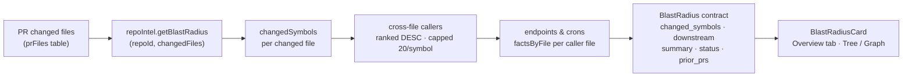

# Blast Radius

Blast Radius answers the question every reviewer asks but cannot see from the diff alone:
**"what could these changes break?"** It maps the PR's changed symbols to every cross-file
caller downstream and surfaces which HTTP endpoints or cron jobs are reachable from those
callers — all without calling a model or re-parsing source.

## The question it answers

A diff shows what changed. It does not show what *depends* on what changed. A one-line
rename in a shared utility can silently break dozens of callers in other files. Blast
Radius makes that invisible impact visible by reading a pre-built call graph built at
index time, so the answer is always fast and never requires a fresh parse of the
repository.

## Token-free by design

Blast Radius is strictly **zero-LLM**. There is no model invocation anywhere in the
request path, no `run_traces` row, and no RunLogger involvement. It reads the repo-intel
index that is built at clone time (or refreshed via `POST /repos/:id/resync`) and
performs a pure in-memory mapping.

The only server endpoint is `GET /pulls/:id/blast` — a plain read, following the same
precedent as `GET /pulls/:id/smart-diff`. The response is deterministic: given the same
index state and the same changed files, the same `BlastRadius` object is always returned.

This means:

- Response time is bounded by a handful of indexed DB reads, not by LLM latency.
- There is no per-call cost beyond compute.
- The result is reproducible and auditable without any prompt engineering.

## The pipeline

*Figure: end-to-end request path from PR changed files to the rendered Overview card.*

### Step-by-step

1. **Changed files** — `repository.ts` reads the `prFiles` table for the given PR (same
   shape as `getPrFiles` in `reviews/repository/pull.repo.ts:29`).

2. **`getBlastRadius`** — the call `container.repoIntel.getBlastRadius(repoId, changedFiles)`
   (`server/src/modules/repo-intel/service.ts:220`) queries the pre-built repo-intel index.
   It returns:
   - `changedSymbols` — symbols (functions, classes, variables) defined in the changed files.
   - `callers` — cross-file call sites that reference those symbols, ranked by file rank
     (descending) and **capped at 20 callers per symbol**.
   - `factsByFile` — per-file metadata including which HTTP endpoints and cron jobs are
     reachable through that file.
   - `degraded` / `reason` — index completeness signals.

3. **`getIndexState`** — a second call to `container.repoIntel.getIndexState(repoId)`
   (`service.ts:189`) returns the `status ∈ full | partial | degraded | failed` enum
   that drives the partial/degraded badge on the card.

4. **`compose.ts`** (pure function, no I/O) — maps the raw repo-intel result into the
   `BlastRadius` contract (`server/src/vendor/shared/contracts/brief.ts`):
   - Groups `callers` by the changed symbol they reference.
   - Attaches `endpoints_affected` and `crons_affected` from `factsByFile` for each
     caller's file.
   - Builds a **deterministic summary string**, e.g.
     `"2 symbols · 14 callers · 3 endpoints (index: full)"`.
   - Attaches `status`, `degraded_reason`, and `prior_prs` (other PRs in the same repo
     whose changed files overlap, newest first).

5. **`BlastRadius` contract** — the shape defined in
   `server/src/vendor/shared/contracts/brief.ts` and mirrored to
   `client/src/vendor/shared/contracts/brief.ts`:

   | Field | Type | Description |
   |---|---|---|
   | `changed_symbols` | `ChangedSymbol[]` | Symbols modified by the PR. |
   | `downstream` | `DownstreamImpact[]` | Per-symbol: callers + affected endpoints/crons. |
   | `summary` | `string` | Deterministic human-readable summary. |
   | `status` | `full\|partial\|degraded\|failed` | Index completeness. |
   | `degraded_reason` | `string \| null` | Why the index is degraded/partial, if applicable. |
   | `prior_prs` | `PriorPr[]` | Earlier PRs touching the same files (bonus context). |

6. **`BlastRadiusCard`** — a client component in
   `client/src/app/repos/[repoId]/pulls/[number]/_components/BlastRadiusCard/`
   rendered in `OverviewTab` (right column). It exposes:
   - A **header** with aggregate counts (symbols / callers / endpoints / crons) from
     the `blast.stat.*` i18n namespace.
   - A **Tree view** (default): each changed symbol expands into its callers, each rendered
     as a `file:line` link via `githubBlobUrl()` (`client/src/utils/github-urls.ts`),
     followed by endpoint/cron `Badge`s.
   - A **Graph view** (toggle): node-link diagram with symbols → callers → endpoints.
   - A **partial/degraded badge** when `status ≠ full`, always showing the reason text —
     never an empty screen.

## Partial and degraded index handling

The repo-intel index may not always be complete. `getIndexState` returns one of four
values:

| Status | Meaning | UI treatment |
|---|---|---|
| `full` | Index is complete and up-to-date. | No badge. |
| `partial` | Only some files were indexed (e.g. large repo). | Yellow badge with explanation. |
| `degraded` | Index exists but some data is unreliable. | Orange badge with reason. |
| `failed` | Index build failed entirely. | Red badge; data may be empty. |

The card **always renders** when the endpoint responds, even if `downstream` is empty.
A `status ≠ full` response carries a human-readable `degraded_reason` string that the
badge displays verbatim. This guarantees the reviewer sees honest signal ("index is
partial — results cover 60% of the codebase") rather than a confusing blank card.

When `REPO_INTEL_ENABLED=false` or the index has never been built, the endpoint returns
a valid `BlastRadius` with empty arrays and `status: 'failed'`. The card renders an
`EmptyState` component — never an error boundary.

## Deliberate scope and future work

**Endpoint mapping is file-scope** in the current implementation: a caller's file is looked
up in `factsByFile` and the endpoints/crons registered to that file are attributed to the
impact. This satisfies the primary use case ("does this caller file host an endpoint?")
without a full traversal.

A **depth-2 import-graph traversal** (following `file_edges` from caller files upward to
route files that are not themselves callers) is noted as a future enhancement. This would
surface endpoints in files that only transitively depend on a changed symbol.

**The deterministic summary is intentionally model-free.** An optional one-cheap-model
summary that paraphrases the blast in natural language was evaluated and deliberately not
taken — keeping the feature strictly token-free was the higher priority.

## API endpoint

| Method | Path | Auth | Description |
|---|---|---|---|
| `GET` | `/pulls/:id/blast` | workspace-scoped (`getContext`) | Returns `BlastRadius`. No run row. No LLM. |

The handler follows the standard `getContext → service.blastForPull(workspaceId, prId) → return`
shape. It never calls `RunLogger`, creates no `run_traces` row, and emits no SSE events.
