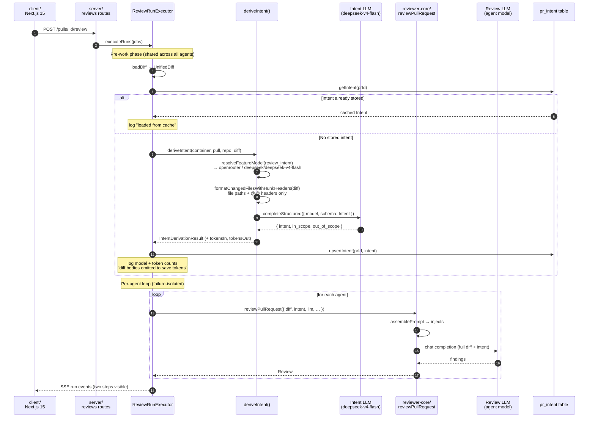

# Intent Cascade (L03)

A two-call design that classifies a PR's intent cheaply before any review agent
runs, then injects that classification into every agent's prompt to keep review
findings on-topic.

## Why two calls?

A full review diff can be large. Sending the entire diff to a cheap classifier
to ask "what is this PR trying to do?" wastes tokens and adds latency on the
expensive review model. Instead, the intent call receives only the structural
outline of the diff — file paths and reconstructed `@@ … @@` hunk headers, with
no added/removed/context line bodies — so the classifier sees the *shape* of the
change without the substance. This keeps the intent call inexpensive enough to
run as pre-work before every review, with a distinct model and budget.

The two calls have entirely separate models, token budgets, and log entries.
Neither outcome affects the other's execution path.

## Run-time flow

### Sequence diagram



The pre-work phase runs once and fans its log events into every queued agent
run's buffer. The intent step and the diff-load step appear as two distinct
entries in each run's trace, each with its own model and token counts.
Intent-derivation failure is best-effort: the executor warns and continues with
`intent = undefined`, leaving all agent runs unaffected.

## Token-saving design

`formatChangedFilesWithHunkHeaders` (in `reviewer-core/src/intent-input.ts`)
converts a `UnifiedDiff` into a compact listing:

```
src/auth/login.ts
@@ -12,8 +12,14 @@
@@ -45,3 +51,3 @@

src/auth/logout.ts
@@ -1,5 +1,5 @@
```

The function emits file paths and reconstructed hunk-position headers only. It
reads no `diff.raw`, no added/removed lines, and no context lines. The run log
records "diff bodies omitted from intent input to save tokens" alongside the
`tokensIn` / `tokensOut` for the intent call.

## Intent model: configuration

The default model for the intent call is resolved by
`resolveFeatureModel(container, workspaceId, 'review_intent')`. The registry
default (in `server/src/vendor/shared/contracts/platform.ts`, mirrored to
`client/src/constants/feature-models.ts`) is:

| Field | Default value |
|---|---|
| Provider | `openrouter` |
| Model | `deepseek/deepseek-v4-flash` |

Users can override this in **Settings → Models** for their workspace. The intent
call always uses whatever the registry resolves; the model is never hardcoded in
`deriveIntent`.

## Storage: `pr_intent` table

A derived intent is persisted one-to-one per PR in the `pr_intent` table (primary
key `prId`, cascade-deleted with the PR). `upsertIntent` replaces the row when
re-derived, so there is always at most one row per PR. The `Intent` shape (from
`@devdigest/shared/contracts/brief.ts`) carries three fields:

| Field | Type | Description |
|---|---|---|
| `intent` | `string` | One-sentence description of the PR's goal. |
| `in_scope` | `string[]` | Files, components, or concerns the PR targets. |
| `out_of_scope` | `string[]` | Related areas the PR deliberately omits. |

## API endpoints

Both endpoints are workspace-scoped (`getContext` at the handler top).

| Method | Path | Description |
|---|---|---|
| `GET` | `/pulls/:id/intent` | Returns `{ intent: Intent \| null }`. Returns `null` (not 404) when no intent has been derived yet. |
| `POST` | `/pulls/:id/intent` | Derives (or re-derives) the intent and persists it. Returns `{ intent, provider, model, tokensIn, tokensOut }`. Rate-limited to 10 calls/minute. |

## Prompt injection

When an intent is available, `assemblePrompt` (in `reviewer-core/src/prompt.ts`)
inserts a `## Derived intent / scope` section into the review agent's user
message, placed after `## PR description` and before `## Diff to review`:

```
## Derived intent / scope
<untrusted source="derived-intent">
…intent text…
</untrusted>
Stay within the stated intent/scope; if you spot a serious out-of-scope problem,
emit ONE signal finding, not many.
```

The `wrapUntrusted` delimiter ensures the derived text is treated as data by the
`INJECTION_GUARD` system rule, not as instructions. The `PromptAssembly.intent`
field in the persisted run trace is populated with the raw intent string (or
`null` when none was supplied).

When `intent` is absent or empty, the section is silently omitted and the prompt
is identical to a pre-L03 prompt — no behavior change for runs without a derived
intent.

## Intent card (PR overview page)

`IntentCard` (`client/src/app/repos/[repoId]/pulls/[number]/_components/IntentCard/`)
renders inside `OverviewTab` and displays:

- The derived intent sentence.
- In-scope and out-of-scope lists.
- A model badge showing which model produced the intent (visible after a manual
  recompute via the "Recompute" button).
- An empty state with a "Derive intent" call-to-action when no intent exists yet.

The card uses `useIntent(prId)` (a TanStack Query `useQuery` over
`GET /pulls/:id/intent`) and `useRecomputeIntent(prId)` (a `useMutation` over
`POST /pulls/:id/intent`). A `404` or `{ intent: null }` response keeps the
empty state; the global query error policy suppresses toasts for expected 4xx
responses.
