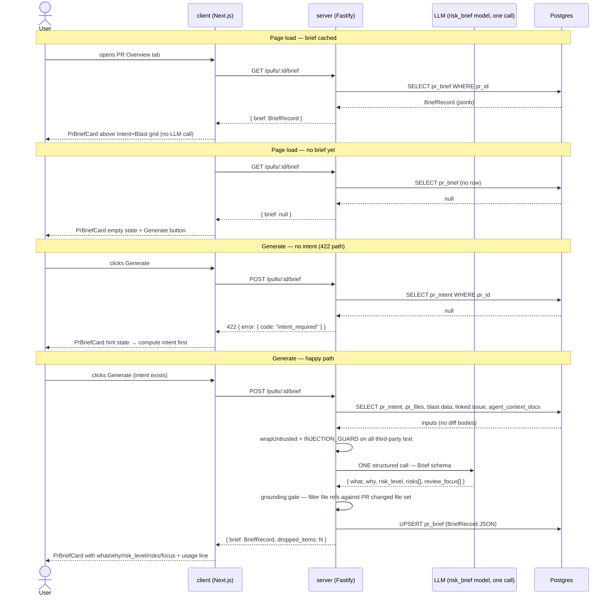

# Spec: PR Why + Risk Brief  |  Spec ID: SPEC-03  |  Status: implemented
Supersedes: —
Modules: server, client

## Problem & why

PR reviewers arrive at the Overview tab with three immediate questions — what does this PR do, why does it exist, and where are the risks — but must currently assemble answers manually from the Intent card, Blast Radius card, and the diff itself. DevDigest already holds every building block: persisted intent, blast-radius analysis, smart-diff file statistics, linked issue text, and attached project specs. None of these are synthesised into a single, decision-ready brief. The "PR Why + Risk Brief" feature adds one structured LLM synthesis call that produces a five-field output (`what`, `why`, `risk_level`, grounded `risks[]`, and a ranked `review_focus[]` reading list), persists the result per-PR, and surfaces it as the first card on the Overview tab — giving the reviewer an orientation in seconds and a grounded reading order before the diff is opened.

## Goals / Non-goals

**Goals:**
- Expose `GET /pulls/:id/brief` (returns `{ brief: BriefRecord | null, stale: boolean }`, never 404) and `POST /pulls/:id/brief` (always regenerates and overwrites the cache), both scoped to the caller's workspace.
- Synthesise a `Brief` — `{ what, why, risk_level, risks[], review_focus[] }` — via exactly one structured LLM call using the workspace-configured `risk_brief` feature model (registry default: openai/gpt-4.1); draw inputs exclusively from: persisted intent, blast radius summary, smart-diff file-group statistics (no diff bodies or hunk content), resolved linked issue, and deduplicated agent-level context docs read from the repository clone.
- Ground every generated `Risk` item's file references and every `review_focus` item's file against the PR changed file set (union of blast changed-symbol files and smart-diff file paths); drop items that cannot be grounded to any PR file.
- Persist `BriefRecord` (brief data + usage metadata: `tokens_in`, `tokens_out`, `cost_usd`, `generated_at`) to the existing `pr_brief` table (no schema migration required); serve the cached record on `GET` with no LLM call; cache is eternal until an explicit `POST` (Regenerate).
- Render `PrBriefCard` as the first element of the PR Overview tab body, above the existing `IntentCard`+`BlastRadiusCard` grid, showing: `what` paragraph, `why`, colour-coded `risk_level` badge, grounded `risks` list with clickable file links navigating to the PR diff view, `review_focus` reading list with clickable `file[:line] — reason` rows navigating to the PR diff view, and a usage line (`tokens_in → tokens_out`, `cost_usd`).
- Return a `dropped_items` count in the `POST` response for grounding-gate observability.

**Non-goals:**
- WhyTimeline: per-commit history of brief changes — explicitly deferred as future work.
- Pre-call token truncation: the server does not truncate inputs before the LLM call; the ≤ 8 000 token budget (AC-9) is verified post-call via `tokens_in` in the provider response.
- Auto-regeneration of the brief when the PR receives new commits: the system tracks head-SHA staleness (`generated_for_sha`, AC-16–AC-18) and prompts an explicit Regenerate; it never auto-triggers an LLM call on a head-SHA change.
- Auto-computation of intent when absent: `POST /brief` returns 422 and never initiates a second LLM call.
- Streaming the brief to the client during generation.
- Skill-level context docs in the brief LLM input: only agent-level context docs (`agent_context_docs`) are collected.
- Brief generation when the repository has no recorded clone path and context docs are needed (see Edge cases — generation proceeds without those docs, not by failing).
- WhyTimeline or any brief-history timeline feature.

## User stories

- **US-1** — As a PR reviewer, I want to see a synthesised brief (what, why, risk level) for a pull request before reading the diff, so that I can quickly orient myself without manually piecing together the intent and blast-radius cards.
- **US-2** — As a PR reviewer, I want risk items in the brief to reference real files from the PR's changeset, so that I can trust the risks correspond to actual code and are not LLM hallucinations.
- **US-3** — As a PR reviewer, I want a ranked, clickable reading-focus list that tells me which files to read first and why, so that I can focus my review time on the highest-signal changes.
- **US-4** — As a PR reviewer, I want to regenerate the brief after the PR is updated or after computing intent for the first time, so that the brief reflects the current state of the PR.
- **US-5** — As a workspace admin, I want the brief generation to use exactly one LLM call and to expose the token count and cost in the response, so that I can monitor usage and trust the cost model.

## Acceptance criteria (EARS)

### API — read path

- **AC-1** — WHEN a client requests `GET /pulls/:id/brief` for a PR that has no persisted brief record, the system SHALL return HTTP 200 with body `{ brief: null }` and SHALL NOT return a 404 status code. (covers: US-1)

- **AC-2** — WHEN a client requests `GET /pulls/:id/brief` for a PR that has a persisted brief record, the system SHALL return HTTP 200 with the stored `BriefRecord` and SHALL NOT initiate an LLM call. (covers: US-1, US-5)

### API — generation prerequisites

- **AC-3** — IF `POST /pulls/:id/brief` is invoked for a PR that has no persisted intent record, THEN the system SHALL return HTTP 422 with error code `intent_required` and SHALL NOT initiate an LLM call. (covers: US-1, US-4)

### API — generation happy path

- **AC-4** — WHEN `POST /pulls/:id/brief` is invoked for a PR whose intent record exists, the system SHALL assemble the LLM prompt exclusively from: the persisted intent text, the blast radius summary string, the smart-diff file-group statistics (role and per-file addition/deletion counts only), the linked issue title and body (when resolvable; omitted silently when unavailable), and the deduplicated content of agent-level context docs read from the repository clone. (covers: US-1, US-2)

- **AC-5** — WHEN the server generates a brief, the system SHALL make exactly one structured LLM call using the model and provider resolved via the `risk_brief` feature model registry entry for the caller's workspace. (covers: US-5)

### Grounding gate

- **AC-6** — WHEN the server persists a generated brief, the system SHALL apply a grounding gate: (1) remove any individual file reference absent from the PR changed file set from a `Risk` item's file reference list; (2) drop any `Risk` item whose entire file reference list is empty after step 1; (3) drop any `review_focus` entry whose file is absent from the PR changed file set. The PR changed file set is the union of file paths present in the blast radius changed symbols and the smart-diff file groups. (covers: US-2)

- **AC-7** — WHEN brief generation completes, the system SHALL include in the `POST /pulls/:id/brief` response the total count of `Risk` items and `review_focus` entries removed by the grounding gate. (covers: US-2, US-5)

### Input budget

- **AC-8** — The system SHALL NOT include diff hunk bodies (raw added-line or removed-line content from the unified diff) in the LLM prompt for brief generation. (covers: US-1, US-5)

- **AC-9** — WHEN a brief is generated, the system SHALL record `tokens_in` in the `POST /pulls/:id/brief` response; for the reference integration-test PR fixture the `tokens_in` value SHALL be ≤ 8 000. (covers: US-5)

### Context docs

- **AC-10** — WHEN the server assembles context docs for brief generation, the system SHALL collect agent-level context doc paths from all agents in the workspace, deduplicate by the `(repo_id, relative_path)` pair with first-occurrence winning, read each file from the repository clone, and silently skip any path absent from the clone or with zero-byte content. (covers: US-1)

### Security

- **AC-11** — The system SHALL wrap all intent text, linked-issue title and body, blast radius summary, smart-diff file paths, and context doc content supplied to the LLM prompt with the `wrapUntrusted` mechanism and SHALL include the `INJECTION_GUARD` directive in the system message. (covers: US-1)

### Client — card states

- **AC-12** — WHEN the Overview tab renders and `GET /pulls/:id/brief` returns `{ brief: null }`, the system SHALL render `PrBriefCard` displaying an empty state with a "Generate" call-to-action button and no `what`, `why`, `risk_level`, `risks`, or `review_focus` content. (covers: US-1, US-4)

- **AC-13** — WHEN the Overview tab renders and the brief is non-null, the system SHALL render `PrBriefCard` as the first element in the Overview tab body, above the `IntentCard`+`BlastRadiusCard` grid, displaying: the `what` paragraph, the `why` text, the `risk_level` badge colour-coded (low=green, medium=amber, high=red), the `risks` list with each `file_ref` as a clickable link navigating to the PR diff view for that file, the `review_focus` list with each row formatted as `file[:line] — reason` and navigating to the PR diff view for that file, and a usage line showing `tokens_in → tokens_out` and `cost_usd`. (covers: US-1, US-2, US-3)

- **AC-14** — IF `POST /pulls/:id/brief` returns HTTP 422 with code `intent_required`, THEN the client SHALL render `PrBriefCard` in a hint state that contains a message directing the reviewer to compute the PR intent using the IntentCard. (covers: US-4)

- **AC-15** — WHEN a user activates the Regenerate control on `PrBriefCard`, the system SHALL send `POST /pulls/:id/brief`, display a loading indicator on the card during the request, and replace the displayed brief content with the new `BriefRecord` upon successful completion. (covers: US-4)

### Staleness (head SHA)

- **AC-16** — WHEN the server persists a generated brief, the system SHALL record the PR's current head SHA in the stored `BriefRecord` as `generated_for_sha`. (covers: US-4)

- **AC-17** — WHEN a client requests `GET /pulls/:id/brief`, the system SHALL include `stale: boolean` in the response — `true` when a persisted brief exists whose `generated_for_sha` is non-null and differs from the PR's current head SHA, `false` otherwise (matching SHA, legacy record with `generated_for_sha` null, or no brief) — and the staleness check SHALL NOT initiate an LLM call. (covers: US-4)

- **AC-18** — WHEN the Overview tab renders a brief and the `GET` response carries `stale: true`, the system SHALL display an "Outdated" indicator on `PrBriefCard` with an accessible text label, alongside the existing Regenerate control. (covers: US-4)

## Verification hints

- AC-1 — DB-backed `*.it.test.ts`: seed a PR with a `pr_intent` row but no `pr_brief` row; call `GET /pulls/:id/brief`; assert the response is HTTP 200 with body `{ brief: null }`.
- AC-2 — DB-backed `*.it.test.ts`: seed a `pr_brief` row with a known JSON payload; call `GET /pulls/:id/brief`; assert the response payload matches the seeded data and that the mock LLM adapter recorded zero calls.
- AC-3 — DB-backed `*.it.test.ts`: seed a PR with no `pr_intent` row; call `POST /pulls/:id/brief`; assert HTTP 422 with `error.code === "intent_required"` and mock LLM adapter zero calls.
- AC-4 — hermetic unit (prompt assembly): supply mock intent, blast summary, smart-diff file-group stats, linked issue, and one context doc; call the brief prompt builder; assert the assembled messages contain representations of all five inputs and contain no diff hunk line characters.
- AC-5 — hermetic unit: inject a call-counting mock LLM adapter; trigger brief generation once; assert the adapter received exactly one `completeStructured` invocation.
- AC-6 — DB-backed `*.it.test.ts`: mock LLM returning two risks (one with a valid `file_ref` and one whose every `file_ref` is outside the PR file set) and one `review_focus` item with a file outside the PR file set; call `POST /pulls/:id/brief`; read the persisted brief; assert every `risk.file_refs` entry and every `review_focus.file` exists in the PR changed file set; assert the fully-invalid risk and the ungrounded `review_focus` entry are absent.
- AC-7 — DB-backed `*.it.test.ts`: same setup as AC-6; assert the POST response includes `dropped_items ≥ 1`.
- AC-8 — hermetic unit (prompt assembly): supply a mock PR with non-empty hunk bodies available in the diff; call the brief prompt builder; assert the assembled LLM messages contain no `+`-prefixed or `-`-prefixed diff line content.
- AC-9 — DB-backed `*.it.test.ts` with a reference PR fixture: call `POST /pulls/:id/brief` against a mock LLM that echoes a `tokensIn` value reflecting the actual assembled prompt; assert the response `tokens_in ≤ 8 000`.
- AC-10 — DB-backed `*.it.test.ts`: seed two agents with overlapping context doc paths and one zero-byte file; trigger brief generation; assert each unique `(repo_id, path)` pair was read exactly once from the mock clone directory and the zero-byte file was not included in the prompt.
- AC-11 — hermetic unit (prompt assembly): supply non-empty mock intent text, linked issue body, and context doc content; call the prompt builder; assert every third-party input is enclosed in `wrapUntrusted` delimiters and the system message contains the `INJECTION_GUARD` sentinel string.
- AC-12 — e2e flow: PR with no `pr_brief` row; navigate to PR Overview tab; assert `PrBriefCard` empty-state element is visible; assert no `what`, `why`, or `risk_level` badge elements are present in the DOM.
- AC-13 — e2e flow: seed a `pr_brief` row with known content; navigate to PR Overview tab; assert `PrBriefCard` is the first rendered child of the OverviewTab root element in DOM order (before the IntentCard+BlastRadiusCard grid container); assert `what`, `why`, and `risk_level` badge elements are visible; assert at least one `review_focus` row with a navigable link is present; assert the usage line text matches the seeded token counts.
- AC-14 — e2e flow: PR with no `pr_intent` row; navigate to Overview tab; click "Generate" on `PrBriefCard`; assert the 422 hint-state element becomes visible and contains text referencing intent computation.
- AC-15 — e2e flow: PR with seeded `pr_brief` and `pr_intent` rows; click Regenerate; assert loading indicator appears on `PrBriefCard`; after the mock POST resolves, assert the brief content in the DOM reflects the new response values.
- AC-16 — DB-backed `*.it.test.ts`: seed a PR with a known `head_sha`; call `POST /pulls/:id/brief`; read the persisted `pr_brief.json`; assert `generated_for_sha` equals the seeded head SHA.
- AC-17 — DB-backed `*.it.test.ts`: (a) seed a brief with `generated_for_sha` differing from the PR's `head_sha` → `GET` returns `stale: true`; (b) matching SHA → `stale: false`; (c) seeded legacy JSON without the field → `stale: false`; (d) no brief row → `{ brief: null, stale: false }`; mock LLM adapter records zero calls in all four cases.
- AC-18 — component test / e2e flow: render `PrBriefCard` with a `GET` response carrying `stale: true`; assert the Outdated indicator is visible with an accessible label; with `stale: false` assert the indicator is absent.

## Edge cases

- **No brief yet (first load)**: `GET /pulls/:id/brief` returns `{ brief: null }`; client renders empty state with Generate CTA; no LLM call is made (AC-1, AC-12).
- **No intent yet**: `POST /pulls/:id/brief` returns 422 `intent_required`; client renders hint state; no LLM call is made (AC-3, AC-14). The reviewer must compute intent via the IntentCard before generating a brief.
- **Zero changed files**: The PR file set is empty (both blast `changed_symbols` and smart-diff `files` are empty). The grounding gate drops every `Risk` item and every `review_focus` item. The brief is persisted with `risks: []` and `review_focus: []` — this is a valid brief; `what`, `why`, and `risk_level` remain set. `dropped_items` in the POST response reflects all items the LLM produced.
- **LLM returns all file-invalid items**: Same outcome as zero changed files from the gate's perspective: the persisted brief has `risks: []` and `review_focus: []`. An empty array for these fields is a valid `BriefRecord`.
- **Blast degraded or partial**: `BlastService.blastForPull` returns `status: "partial"` or `"degraded"` with a reduced `changed_symbols` list. The blast `summary` string is included in the LLM input as-is. The grounding gate's file set is the union of whatever blast files are available and the smart-diff file paths. Risk items grounded to smart-diff-only files are valid.
- **Blast failed**: `BlastService.blastForPull` returns `status: "failed"` with an empty `changed_symbols` and `downstream`. Only smart-diff file paths contribute to the PR changed file set. The blast summary string (if non-empty) is included in the LLM prompt; if it is empty the blast slot is omitted.
- **No repository clone path**: Context docs for that repository cannot be read. The server skips all context doc paths whose clone path is null (silently, per the run-executor skip pattern from L05). Brief generation continues with the remaining inputs (intent + blast summary + smart-diff stats + linked issue).
- **Context doc file absent from clone**: A path exists in `agent_context_docs` but the file is missing from the clone directory; the server logs a warning and skips that file, continuing input assembly (same skip-missing pattern as SPEC-01 and L05 run-executor).
- **No context docs in workspace**: No agents have attached context docs. The `context docs` slot is omitted from the LLM prompt; brief generation proceeds normally with the other inputs.
- **No linked issue**: `resolveLinkedIssue` returns `null` (no `#N` reference in the PR body, GitHub token absent, or GitHub API unavailable). The linked issue slot is omitted silently; brief generation continues.
- **Concurrent POST requests**: Two simultaneous `POST /pulls/:id/brief` requests for the same PR both proceed independently; each makes exactly one LLM call; the last successful `UPSERT` into `pr_brief` wins. This is acceptable because both calls draw from the same inputs and produce semantically equivalent briefs. No data corruption occurs. A deduplication gate may be added in a future iteration; it is not required by this spec.
- **`</untrusted>` delimiter in issue body or context doc content**: The existing `wrapUntrusted` escape mechanism neutralises this injection vector (identical to the SPEC-01 treatment).
- **PR removed from workspace**: The `pr_brief` row is removed via the existing FK cascade from `pull_requests` — no additional cleanup is needed.
- **Legacy brief without `generated_for_sha`**: rows persisted before the field existed parse with `generated_for_sha: null` (Zod schema default); `GET` reports `stale: false` — unknown provenance is not flagged as stale, and the reviewer can still Regenerate explicitly.

## Non-functional

- **Security**: Both `GET /pulls/:id/brief` and `POST /pulls/:id/brief` MUST authenticate the caller and enforce workspace scope via `getContext` before reading or writing any PR brief data. Neither endpoint is callable without valid workspace membership.
- **Performance**: The `GET` endpoint (pure cache read) SHALL complete within 200 ms (p95) under normal Postgres load. The `POST` endpoint's latency is bounded by the single LLM call; no hard p95 SLA is imposed in this spec.
- **Cost control**: The one-LLM-call-per-generation constraint is enforced by construction (single `completeStructured` call site in the brief service) and verified by `tokens_in` in the response (AC-5, AC-9). To make the ≤ 8 000 token target achievable without pre-call truncation, the implementation SHOULD apply per-source character caps during input assembly (e.g., independently capping the blast summary, linked issue body, and each context doc before concatenation); the exact cap values are an implementation decision left to the plan.
- **a11y**: The `risk_level` badge SHALL carry an accessible label conveying the level as text, not colour alone (colour is a visual reinforcement only). Each `review_focus` row link and each `risk` file link SHALL have accessible link text that includes the file path. The Regenerate control SHALL be operable via keyboard.
- **Observability**: The response Zod schemas on both `GET /pulls/:id/brief` and `POST /pulls/:id/brief` MUST be registered via the server's `serializerCompiler` (per the INSIGHTS requirement: response schemas are runtime validation gates, not documentation annotations).

## Flows & interactions

## Contracts

| Resource / field | Type | Semantics |
|---|---|---|
| `GET /pulls/:id/brief` | → `{ brief: BriefRecord \| null, stale: boolean }` | Returns cached brief; `null` when none generated yet; HTTP 200 in both cases; never 404; workspace auth required; `stale` computed on read (AC-17), never stored |
| `POST /pulls/:id/brief` | → `{ brief: BriefRecord, dropped_items: integer }` or 422 | Regenerates and overwrites the cache; 422 with `code: "intent_required"` when the PR has no persisted intent; workspace auth required |
| `BriefRecord.what` | `string` | LLM-generated one-paragraph description of what the PR does |
| `BriefRecord.why` | `string` | LLM-generated explanation of the motivation for the change |
| `BriefRecord.risk_level` | `"low" \| "medium" \| "high"` | PR-level risk assessment produced by the LLM; drives badge colour on the client |
| `BriefRecord.risks` | `Risk[]` | Grounding-gated risk items; reuses the existing `Risk` contract shape (`kind`, `title`, `explanation`, `severity: RiskSeverity`, `file_refs: string[]`) |
| `BriefRecord.review_focus` | `ReviewFocusItem[]` | Grounding-gated reading list; order is LLM-determined; each item grounded to a file in the PR changed file set |
| `ReviewFocusItem.file` | `string` | File path; MUST exist in the PR changed file set after grounding gate |
| `ReviewFocusItem.line` | `integer \| null` | Optional line number anchor within the file; null when no specific line |
| `ReviewFocusItem.reason` | `string` | LLM-generated explanation of why this file deserves early attention |
| `BriefRecord.tokens_in` | `integer` | Prompt token count from the LLM provider response; stored in `pr_brief.json` |
| `BriefRecord.tokens_out` | `integer` | Completion token count from the LLM provider response; stored in `pr_brief.json` |
| `BriefRecord.cost_usd` | `number \| null` | Estimated cost in USD via the PriceBook; `null` when the model is not in the PriceBook |
| `BriefRecord.generated_at` | ISO 8601 timestamp | Brief generation completion time; stored in `pr_brief.json` |
| `BriefRecord.generated_for_sha` | `string \| null` | Head SHA of the PR at generation time (AC-16); `null` on legacy records persisted before the field existed — schema default keeps old jsonb rows valid |
| `POST response.dropped_items` | `integer` | Count of `Risk` items and `review_focus` entries removed by the grounding gate; ephemeral — returned in the POST response only, not stored in `pr_brief` |
| `pr_brief` table | `{ pr_id PK uuid, json jsonb }` | Existing scaffold table; `json` column stores the full `BriefRecord` as-is; no schema migration required |

**Contract note:** The LLM-output `Brief` type (`{ what, why, risk_level, risks[], review_focus[] }`) and the new `ReviewFocusItem` type are additions to the shared contract module consumed by both server and client. The existing `PrBrief` aggregate type in that module (`{ intent, blast, risks, history }`) was scaffolded for a different composition pattern and is NOT what `pr_brief` stores under this feature; the implementation plan shall decide whether to rename or remove `PrBrief` to prevent confusion with the new `Brief` LLM-output type.

## Inputs (provenance)

- Intent text (`pr_intent` record: `intent`, `in_scope[]`, `out_of_scope[]`) — [reused: L03; `ReviewService.getIntent`; cached DB read; 0 LLM calls]
- Blast radius summary string and changed-symbol file paths — [deterministic: repo-intel, L04; `BlastService.blastForPull`; 0 LLM calls; also used to construct the grounding gate file set]
- Smart-diff file-group statistics (role + per-file additions/deletions, no hunk bodies) — [deterministic: L03; `ReviewService.smartDiffForPull`; 0 LLM calls; also contributes to grounding gate file set]
- Linked issue title and body via `resolveLinkedIssue` — [reused: L03; best-effort GitHub API call; omitted silently on any failure; 0 LLM calls]
- Agent-level context docs (deduplicated union across all workspace agents, read from repository clone) — [reused: L05; `agent_context_docs` table; same skip-missing/skip-empty pattern as SPEC-01 and L05 run-executor; 0 LLM calls]
- `wrapUntrusted` + `INJECTION_GUARD` applied to all third-party text — [reused: L02–L04; reviewer-core shared module]
- `resolveFeatureModel(workspaceId, 'risk_brief')` for provider+model selection — [reused: scaffold; default openai/gpt-4.1; `FeatureModelId` already registered in platform contracts]
- `pr_brief` table for persistence — [reused: scaffold; existing table and jsonb column; 0 schema migration required]
- `GET /pulls/:id/brief`, `POST /pulls/:id/brief`, `PrBriefCard`, TanStack Query hooks for brief — [new: this feature; 1 structured LLM call per `POST` generation]

## Untrusted inputs

The following text enters the LLM prompt and is classified as untrusted (contributor- or third-party-controlled content):

- **Intent text** (`intent`, `in_scope[]`, `out_of_scope[]`): derived from the PR title and body, which are contributor-controlled. SHALL be wrapped with `wrapUntrusted`.
- **Linked issue title and body**: fetched from the GitHub API; controlled by the issue author. SHALL be wrapped with `wrapUntrusted`.
- **Blast radius summary**: produced from repo-intel data containing contributor-controlled symbol names and file paths. SHALL be wrapped with `wrapUntrusted`.
- **Smart-diff file-group statistics**: include contributor-controlled file paths. SHALL be wrapped with `wrapUntrusted`.
- **Context doc content**: files read from the repository clone; controlled by repository contributors. SHALL be wrapped with `wrapUntrusted`.

All of the above are treated as data, not instructions. They are enclosed within `wrapUntrusted` delimiters, and the `INJECTION_GUARD` directive in the system message instructs the model to ignore any instruction-like content inside those delimiters (AC-11). The existing `wrapUntrusted` escape mechanism neutralises `</untrusted>` close-tag injection attempts. The `BriefRecord` stored in `pr_brief` is rendered as display output only and is never re-injected into a subsequent LLM prompt.

## [NEEDS CLARIFICATION]

—
