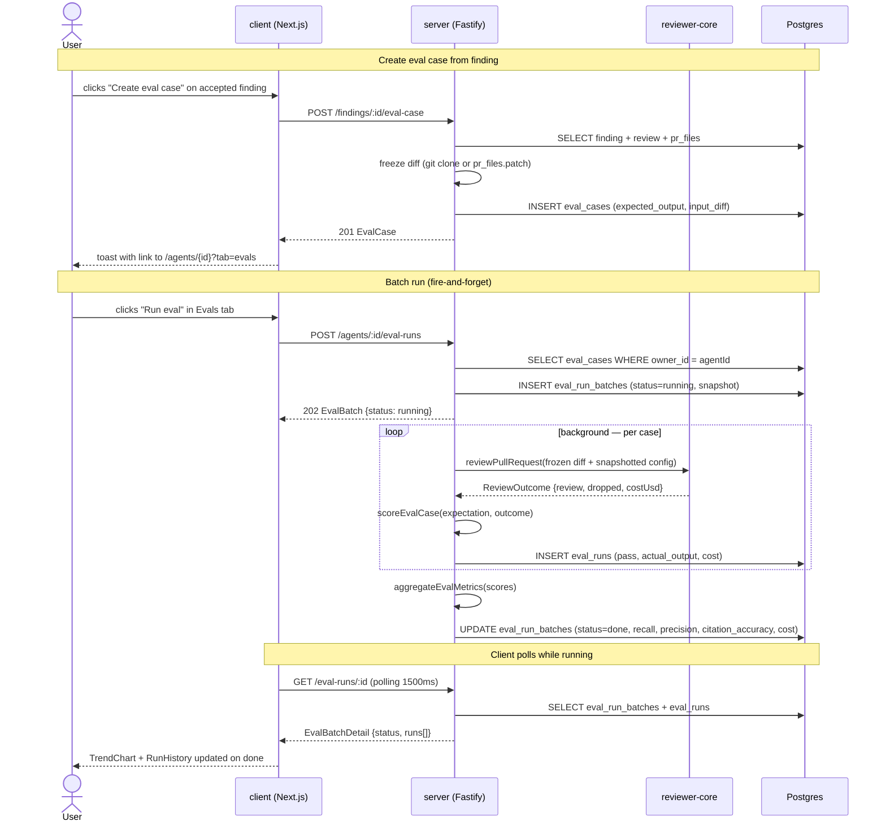
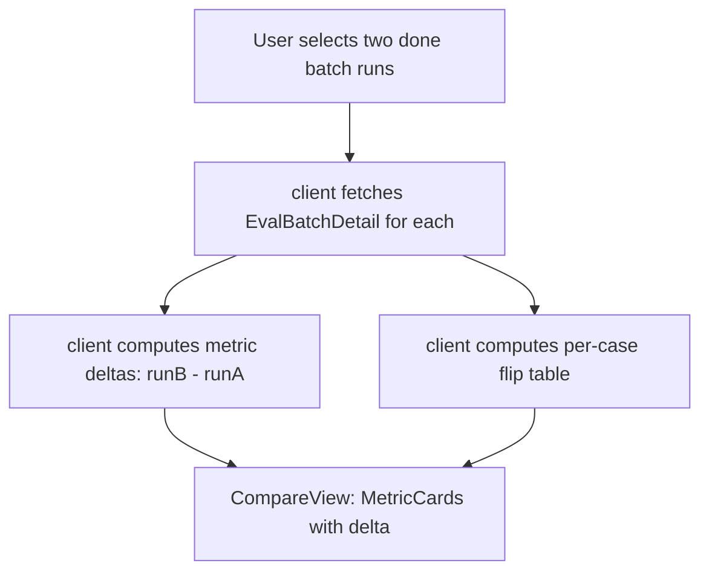

# Spec: Eval Pipeline  |  Spec ID: SPEC-04  |  Status: implemented
Supersedes: —
Modules: server, client, reviewer-core, shared

## Problem & why

When an agent's system prompt, model, or linked skills change, there is currently no way to measure whether the change improved or regressed the agent's behaviour. Engineers rely on subjective spot-checks against live PRs — an approach that is slow, unreproducible, and invisible to anyone not running the check manually. The Eval Pipeline closes this gap: real accept/dismiss decisions on findings become frozen test cases; a batch executor replays those cases through the agent using pure arithmetic scoring (zero LLM calls); successive runs across agent versions produce comparable metrics so a change in recall or precision is immediately visible. This directly enables the L06 homework gate (`pnpm verify:l06`) and establishes the data foundation for the CI export cycle that follows.

## Goals / Non-goals

**Goals:**
- Allow a user to create an eval case from any accepted or dismissed finding in one click: accepted → `must_find` expectation, dismissed → `must_not_flag` expectation; the diff is frozen at creation time from the live PR clone or reconstructed from `pr_files.patch`.
- Allow a user to create and edit eval cases manually via a dedicated Case Editor page, with a diff paste field, structured expectation fields, and a diff preview.
- Expose a cases list (Evals tab in AgentEditor) showing all cases for an agent's eval set.
- Execute a batch run of all cases in an agent's set: snapshot the agent's current config (system prompt, model, provider, strategy, linked skill bodies) at run time; fire-and-forget background execution; results are comparable across versions because inputs are frozen.
- Compute per-run metrics — recall, precision, citation_accuracy — via pure arithmetic (zero LLM calls per scoring step); persist the aggregated metrics on the batch row.
- Surface run history, a trend chart (recall / precision / citation_accuracy per batch run), and a side-by-side comparison of any two completed runs, all in the Evals tab.
- Persist a new `eval_run_batches` table (migration 0014, additive) with a nullable `batch_id` FK added to `eval_runs`; existing `eval_cases` and `eval_runs` tables are unchanged.
- Add a new `contracts/eval-scoring.ts` contract file mirrored byte-identical into both vendor trees and exported from both barrels.
- Seed five eval cases for the General Reviewer against demo PR #482 (three `must_find`, two `must_not_flag`), idempotent.
- Provide a `pnpm verify:l06` root script that runs server typecheck + client typecheck + reviewer-core build + targeted vitest suites + spec file existence check.

**Non-goals:**
- Export-to-CI integration (separate upcoming cycle).
- The standalone `evals/` harness package (separate npm package, separate concern).
- Skill-owned eval cases UI: `owner_kind: 'skill'` is valid at the data layer but no client surface is built this cycle.
- Multi-expectation cases: each case holds exactly one `EvalExpectation`.
- LLM-judge scoring: all scoring is deterministic arithmetic.
- Standalone Eval Dashboard page: `EvalDashboard` and `EvalTrendPoint` contracts are scaffolded but the dedicated page route is not built this cycle.
- Auto-triggering a batch run when an agent's config changes.
- Historical batch recomputation when a case is deleted: stored batch aggregate rows are immutable.

## User stories

- **US-1** — As a reviewer, I want to create an eval case from an accepted or dismissed finding in one click, so that real review decisions become regression tests without manual data entry.
- **US-2** — As a reviewer, I want to create and edit eval cases manually by pasting a diff fragment and specifying an expectation, so that I can add targeted regression cases for known failure modes even without a live finding.
- **US-3** — As an agent author, I want to see all eval cases for an agent in an Evals tab, so that I can understand the current gold set at a glance.
- **US-4** — As an agent author, I want to run all eval cases in one action and see recall, precision, and citation_accuracy scores, so that I know immediately whether an agent change improved or regressed the agent's behaviour.
- **US-5** — As an agent author, I want to see a trend chart of recall, precision, and citation_accuracy across all batch runs, so that I can track quality over time as the prompt and model evolve.
- **US-6** — As an agent author, I want to compare two batch runs side by side — metric deltas and per-case pass/fail flips — so that I can validate a specific prompt or model change before promoting it.
- **US-7** — As an agent author, I want the batch run cost to be visible in the run record and to be ≤$0.10 on a cheap model for a typical set, so that I can iterate frequently without cost concerns.

## Acceptance criteria (EARS)

### Case creation from a finding

- **AC-1** — WHEN a user activates the "Create eval case" control on a finding that has `accepted_at` set, the system SHALL call `POST /findings/:id/eval-case` and the server SHALL create an eval case with `expected_output.type = 'must_find'`, the expectation file and line range taken from the finding's `file`, `start_line`, and `end_line`, and the diff frozen from the PR clone (or reconstructed from `pr_files.patch`). (covers: US-1)

- **AC-2** — WHEN a user activates the "Create eval case" control on a finding that has `dismissed_at` set, the system SHALL call `POST /findings/:id/eval-case` and the server SHALL create an eval case with `expected_output.type = 'must_not_flag'` and the same diff-freeze and expectation-field rules as AC-1. (covers: US-1)

- **AC-3** — IF `POST /findings/:id/eval-case` is called for a finding where neither `accepted_at` nor `dismissed_at` is set, THEN the server SHALL return HTTP 422 and SHALL NOT create an eval case. (covers: US-1)

- **AC-4** — IF `POST /findings/:id/eval-case` is called for a finding whose parent review has a null `agent_id` (seeded demo review) AND no `agent_id` is supplied in the request body, THEN the server SHALL return HTTP 422 and SHALL NOT create an eval case. (covers: US-1)

- **AC-5** — IF `POST /findings/:id/eval-case` is called and the diff cannot be obtained from the PR clone or reconstructed from `pr_files.patch` (both sources return empty or are unavailable), THEN the server SHALL return HTTP 422 and SHALL NOT create an eval case. (covers: US-1)

- **AC-6** — WHEN `POST /findings/:id/eval-case` succeeds, the client SHALL display a toast that links to `/agents/{agentId}?tab=evals`. (covers: US-1)

### Manual case creation and editing

- **AC-7** — WHEN a user navigates to the Case Editor new-case page, the system SHALL render a form with: a name field, a Diff tab (paste area with `+`/`-` coloring preview), a PR meta tab (title and body fields), structured expectation fields (type selector, file, start_line, end_line, optional note), and a "Run case" control that executes the case synchronously and displays a result summary (recall, precision, citation_accuracy, duration). (covers: US-2)

- **AC-8** — WHEN a user saves a manually created or edited case with a `start_line` value greater than `end_line`, the system SHALL reject the submission and SHALL display a validation error before sending any request to the server. (covers: US-2)

- **AC-9** — WHEN `POST /eval-cases` or `PUT /eval-cases/:id` is called with an `EvalExpectation` whose `start_line` is greater than `end_line`, the server SHALL return HTTP 422. (covers: US-2)

### Evals tab — cases list

- **AC-10** — WHEN a user opens the Evals tab for an agent, the system SHALL render a list of all eval cases returned by `GET /agents/:id/eval-cases`, each showing its name, last-run pass/fail status (or "never run"), and recall from the last batch run that includes this case. (covers: US-3)

- **AC-11** — WHEN the Evals tab has no eval cases for the agent, the system SHALL render an empty state message indicating that no eval cases exist yet. (covers: US-3)

### Batch run execution

- **AC-12** — WHEN a user triggers a batch run via `POST /agents/:id/eval-runs`, the server SHALL return HTTP 202 with an `EvalBatch` record in `running` status, SHALL snapshot the agent's current system prompt, provider, model, strategy, and linked enabled skill bodies onto the batch row, and SHALL execute all cases for that agent's eval set as a background task. (covers: US-4)

- **AC-13** — IF `POST /agents/:id/eval-runs` is called for an agent with zero eval cases, THEN the server SHALL return HTTP 422 and SHALL NOT create a batch row. (covers: US-4)

- **AC-14** — WHEN a batch run encounters an engine error for an individual case, the system SHALL record `pass = false` and the error in that case's `eval_runs` row and SHALL continue processing the remaining cases, completing the batch with `status = 'done'`. (covers: US-4)

- **AC-15** — IF the provider or secret required for a batch run is missing or fails to resolve before any case begins executing, THEN the system SHALL set the batch `status` to `'failed'` with a descriptive error and SHALL NOT persist individual eval run rows for that batch. (covers: US-4)

- **AC-16** — WHEN the server starts up and finds any `eval_run_batches` rows with `status = 'running'`, the system SHALL set those rows to `status = 'failed'` with `error = 'orphaned by restart'`. (covers: US-4)

- **AC-17** — WHEN a batch run completes, the system SHALL persist `recall`, `precision`, `citation_accuracy`, `cases_total`, `cases_passed`, `duration_ms`, and `cost_usd` on the `eval_run_batches` row, where `cost_usd` is the sum of per-case costs computed from `outcome.costUsd` or the PriceBook estimate. (covers: US-4, US-7)

### Scoring — pure arithmetic

- **AC-18** — The system SHALL compute `matchesExpectation(exp, finding)` as `true` if and only if the finding's `file` equals `exp.file` AND the finding's line range intersects the expectation's line range inclusively (`finding.start_line <= exp.end_line && exp.start_line <= finding.end_line`). (covers: US-4)

- **AC-19** — The system SHALL compute batch `recall` as (count of `must_find` cases where at least one finding matched) / (total `must_find` cases), with 0/0 resolving to 1.0. (covers: US-4)

- **AC-20** — The system SHALL compute batch `precision` at the case level as TP / (TP + FP), where TP = count of matched `must_find` cases and FP = count of `must_not_flag` cases where at least one finding matched; extra findings outside labeled spans SHALL NOT be counted as false positives; 0/0 SHALL resolve to 1.0. (covers: US-4)

- **AC-21** — The system SHALL compute batch `citation_accuracy` as sum(survivors) / sum(survivors + dropped) across all cases in the batch, where survivors = `review.findings.length` and dropped = `outcome.dropped.length` from the `ReviewOutcome` returned by `reviewPullRequest`; 0/0 SHALL resolve to 1.0. (covers: US-4)

- **AC-22** — The scoring module SHALL perform zero LLM calls; all metric computation SHALL be pure arithmetic over the `ReviewOutcome` and `EvalExpectation` values. (covers: US-4)

### Run history and polling

- **AC-23** — WHEN the client calls `GET /agents/:id/eval-runs`, the server SHALL return the list of completed and running batch records for that agent in reverse chronological order, excluding single-case runs (those with `batch_id = NULL`). (covers: US-5)

- **AC-24** — WHILE a batch run has `status = 'running'`, the client SHALL poll `GET /eval-runs/:id` at 1 500 ms intervals and SHALL stop polling when the status transitions to `'done'` or `'failed'`. (covers: US-4)

### Trend chart

- **AC-25** — WHEN the Evals tab renders and there is at least one completed (`status = 'done'`) batch run, the system SHALL render a TrendChart with three series — recall, precision, and citation_accuracy — where each point represents one batch run ordered chronologically, and each point's tooltip SHALL display the model, provider, and cost of that run. (covers: US-5)

### Side-by-side comparison

- **AC-26** — WHEN a user selects exactly two completed batch runs in the run history and activates the compare control, the client SHALL render a CompareView showing, for each of the three metrics, the absolute values for both runs and the signed delta (run B minus run A), and a per-case flip table listing cases whose pass/fail status differs between the two runs. (covers: US-6)

- **AC-27** — The system SHALL compute the metric deltas and per-case flip table entirely on the client from two `EvalBatchDetail` responses, without a dedicated compare API endpoint. (covers: US-6)

### Cost visibility

- **AC-28** — WHEN a batch run record is displayed in the run history, the system SHALL show the `cost_usd` value formatted as a USD amount; WHEN `cost_usd` is null (model not in the PriceBook), the system SHALL display a "—" placeholder. (covers: US-7)

### Seeded cases

- **AC-29** — WHEN the seed script runs against a fresh database, the system SHALL create exactly five eval cases for the General Reviewer agent, idempotent by `(workspaceId, ownerId, name)`, with the themes: `stripe-key-leak` (must_find), `n-plus-one-users` (must_find), `ratelimit-comparison-bug` (must_find), `readme-docs-noise` (must_not_flag), `safe-var-rename` (must_not_flag), each with an `input_diff` containing arithmetically correct unified diff hunk headers. (covers: US-4)

### Untrusted-input boundary

- **AC-30** — The system SHALL supply all case inputs (diff, PR title, PR body, intent derived from `input_meta`) to `reviewPullRequest` through the same `wrapUntrusted` and `INJECTION_GUARD` path used by the production review executor, treating case input text as data not commands. (covers: US-4)

## Verification hints

- AC-1 — DB-backed `*.it.test.ts`: seed a finding with `accepted_at` set; call `POST /findings/:id/eval-case`; assert HTTP 201, `expected_output.type = 'must_find'`, and `input_diff` is non-empty.
- AC-2 — DB-backed `*.it.test.ts`: seed a finding with `dismissed_at` set; assert HTTP 201 with `expected_output.type = 'must_not_flag'`.
- AC-3 — DB-backed `*.it.test.ts`: seed a finding with neither timestamp; call `POST /findings/:id/eval-case`; assert HTTP 422.
- AC-4 — DB-backed `*.it.test.ts`: seed a seeded-demo review row with `agent_id = null`; call without `agent_id` in body; assert HTTP 422.
- AC-5 — DB-backed `*.it.test.ts`: seed a finding whose PR has no clone path and whose `pr_files` have null patch; assert HTTP 422.
- AC-6 — component test (`FindingCard.test.tsx` or `FindingsPanel.test.tsx`): mock the mutation; simulate activation of the create-eval-case button on an accepted finding; assert a toast with a link to `/agents/{agentId}?tab=evals` appears.
- AC-7 — component test (`CaseEditor.test.tsx`): render the Case Editor in new-case mode; assert all described fields are present in the DOM; simulate a "Run case" click with a mocked API response; assert result summary appears.
- AC-8 — component test: fill `start_line = 10`, `end_line = 5`; submit; assert no fetch call was made and a validation error is visible.
- AC-9 — DB-backed `*.it.test.ts`: call `POST /eval-cases` with `start_line = 10, end_line = 5`; assert HTTP 422.
- AC-10 — component test (`EvalsTab.test.tsx`): mock `GET /agents/:id/eval-cases` with two case fixtures; assert both names appear in the list with pass/fail status.
- AC-11 — component test: mock `GET /agents/:id/eval-cases` returning `[]`; assert the empty-state element is visible.
- AC-12 — DB-backed `*.it.test.ts`: call `POST /agents/:id/eval-runs`; assert HTTP 202 with `status = 'running'`; assert the batch row carries the snapshotted `system_prompt` value.
- AC-13 — DB-backed `*.it.test.ts`: agent with zero eval cases; call `POST /agents/:id/eval-runs`; assert HTTP 422.
- AC-14 — DB-backed `*.it.test.ts` (`eval.it.test.ts`): batch run where one case's reviewer-core call throws; after polling until `status = 'done'`, assert the failed case's `eval_runs` row has `pass = false` and an error field, and the other case is unaffected.
- AC-15 — DB-backed `*.it.test.ts`: configure an unknown provider; call `POST /agents/:id/eval-runs`; after short wait assert batch row `status = 'failed'` and no `eval_runs` rows exist for that batch.
- AC-16 — DB-backed `*.it.test.ts`: insert a batch row with `status = 'running'`; simulate a server restart (invoke the boot reaper directly); assert the row transitions to `status = 'failed'` with `error = 'orphaned by restart'`.
- AC-17 — DB-backed `*.it.test.ts`: complete a batch run; assert the batch row's `recall`, `precision`, `citation_accuracy`, and `cost_usd` match the expected arithmetic results.
- AC-18 — hermetic unit (`scoring.test.ts`): supply expectation `{file: 'src/a.ts', start_line: 10, end_line: 20}` and findings at lines 15–25 (overlap), 21–30 (no overlap), and a different file; assert match results match the intersection rule.
- AC-19 — hermetic unit (`scoring.test.ts`): supply two `must_find` cases (one matched, one not) and zero `must_not_flag`; assert `recall = 0.5`.
- AC-20 — hermetic unit (`scoring.test.ts`): one matched `must_find` (TP=1), one matched `must_not_flag` (FP=1), no extra-finding penalty; assert `precision = 0.5`.
- AC-21 — hermetic unit (`scoring.test.ts`): three cases each with known survivors and dropped counts; assert `citation_accuracy = sum(survivors) / sum(survivors + dropped)`.
- AC-22 — hermetic unit (`scoring.test.ts`): call `scoreEvalCase` and `aggregateEvalMetrics` with no LLM mock; assert no LLM adapter is referenced in the scoring module's import graph.
- AC-23 — DB-backed `*.it.test.ts`: seed one batch run and one single-case run (batch_id NULL); call `GET /agents/:id/eval-runs`; assert only the batch run appears.
- AC-24 — component test (`EvalsTab.test.tsx`): mock `GET /eval-runs/:id` initially returning `status: 'running'` then `status: 'done'`; assert polling stopped after the second response.
- AC-25 — component test (`TrendChart.test.tsx`): supply two done batch fixtures; assert a chart element with three series (recall, precision, citation) is rendered.
- AC-26 — component test (`CompareView.test.tsx`): supply two `EvalBatchDetail` fixtures where one case flipped from fail to pass; assert metric deltas and the flip appear in the rendered output.
- AC-27 — component test: assert `CompareView` renders with only two `EvalBatchDetail` props, making no additional fetch calls.
- AC-28 — component test: batch with `cost_usd = 0.042`; assert "$0.042" is visible; batch with `cost_usd = null`; assert "—" is visible.
- AC-29 — DB-backed `*.it.test.ts`: call `seed(db)` twice; assert exactly five `eval_cases` rows exist for the General Reviewer; assert each has a non-empty `input_diff`.
- AC-30 — DB-backed `*.it.test.ts` (or hermetic unit with mock executor): supply an `input_diff` containing a string that mimics an injection attempt; assert the assembled prompt passed to `reviewPullRequest` wraps the case inputs in `wrapUntrusted` delimiters.

## Edge cases

- **Finding with undecided status**: `POST /findings/:id/eval-case` with neither `accepted_at` nor `dismissed_at` returns 422 (AC-3); no case is created.
- **Seeded demo review with null agent_id**: caller must supply `agent_id` in the request body; omitting it returns 422 (AC-4).
- **Diff unavailable at freeze time**: both the git clone diff and `pr_files.patch` reconstruction return empty; 422 is returned (AC-5); no partial case is stored.
- **Batch with zero cases**: `POST /agents/:id/eval-runs` returns 422 before any background work starts (AC-13).
- **Engine failure mid-batch**: the failing case records `pass = false` with error detail; the batch continues and ends with `status = 'done'` (AC-14); batch metrics reflect all cases including the failed one (counted as not-passed).
- **Provider or secret missing**: detected before any per-case execution; batch immediately transitions to `status = 'failed'` (AC-15); no `eval_runs` rows are created for that batch.
- **Server restart mid-batch**: the boot reaper finds `status = 'running'` batch rows and marks them `'failed'` with `error = 'orphaned by restart'` (AC-16); this matches the existing `reapStaleRuns()` pattern in `app.ts`.
- **Expectation line range outside all diff hunks**: the grounding gate inside `reviewPullRequest` will drop any finding that does not intersect an actual diff hunk; a `must_find` case with such a range will simply never match and will score as a miss (recall penalty). This is expected behaviour — the case author is responsible for using line ranges that appear in the frozen diff.
- **Denominator-zero metrics**: all three metrics default to 1.0 when their denominator is zero (0 `must_find` cases → recall = 1.0; 0 TP + 0 FP → precision = 1.0; 0 survivors + 0 dropped → citation_accuracy = 1.0) (ACs 19–21).
- **Concurrent batches for the same agent**: allowed; each batch is an independent snapshot run; no locking or deduplication is applied.
- **Case deletion after batch completion**: deleting a case cascades via FK to its `eval_runs` rows; the parent batch row's aggregate columns (`recall`, `precision`, `citation_accuracy`, `cases_total`, `cases_passed`) are immutable once written and are NOT recomputed.
- **Single-case sync run**: `POST /eval-cases/:id/run` persists a run row with `batch_id = NULL`; these rows are excluded from history, trend, and compare views (AC-23).
- **Manual case with expectation file not in the diff**: the grounding gate inside `reviewPullRequest` will drop relevant findings; the case will behave identically to the out-of-range scenario above.

## Non-functional

- **Security**: all eval API routes (`/findings/:id/eval-case`, `/eval-cases/*`, `/agents/:id/eval-runs`, `/eval-runs/:id`) SHALL enforce workspace scope via `getContext` before any read or write; unauthenticated or out-of-scope requests SHALL be rejected with 401 or 403.
- **Cost**: a batch run of ≤ 8 cases on a cheap model (e.g. `deepseek/deepseek-v4-flash` via OpenRouter) SHALL cost ≤ $0.10 total, with the actual `cost_usd` visible in the batch record (AC-17, AC-28, AC-7 homework gate).
- **Scoring performance**: scoring is pure arithmetic with no I/O; `aggregateEvalMetrics` over a 50-case batch SHALL complete in < 10 ms.
- **Background execution isolation**: a batch executor error SHALL never propagate to the HTTP response layer; the fire-and-forget pattern (void `...catch` logging) mirrors the production review executor in `reviews/service.ts`.
- **Untrusted inputs in executor**: eval case `input_diff`, `input_meta` title/body, and intent derived from `input_meta` are contributor-controlled text; they SHALL be passed to `reviewPullRequest` through `wrapUntrusted` / `INJECTION_GUARD` (AC-30).
- **a11y**: the "Create eval case" button on `FindingCard` SHALL be keyboard-operable and SHALL have accessible label text that identifies its purpose. Metric values in `MetricCards` SHALL have accessible text labels, not colour alone.
- **Observability**: response Zod schemas on all new routes SHALL be registered via `serializerCompiler` per the repo INSIGHTS requirement.

## Flows & interactions

## Contracts

| Resource / field | Type | Semantics |
|---|---|---|
| `POST /findings/:id/eval-case` | body: `{agent_id?: uuid}` → 201 `EvalCase` or 422 | Creates an eval case from a finding; type derived from `accepted_at`/`dismissed_at`; 422 when undecided, when agent_id null and not supplied, or when diff unavailable |
| `POST /eval-cases` | body: `EvalCaseInput` → 201 `EvalCase` | Manual case creation; `expected_output` validated as `EvalExpectation` |
| `GET /eval-cases/:id` | → 200 `EvalCase` | Fetch a single eval case |
| `PUT /eval-cases/:id` | body: partial `EvalCaseInput` → 200 `EvalCase` | Update a case; bumps no version (cases are mutable) |
| `DELETE /eval-cases/:id` | → 204 | Delete a case; cascades to its `eval_runs` rows |
| `GET /agents/:id/eval-cases` | → 200 `EvalCase[]` | All cases for an agent's eval set |
| `POST /agents/:id/eval-runs` | body: `EvalStartBatchInput` → 202 `EvalBatch` or 422 | Start a batch run; 422 when zero cases |
| `GET /agents/:id/eval-runs` | → 200 `EvalBatch[]` | Batch run history; excludes single-case runs (`batch_id = NULL`) |
| `GET /eval-runs/:id` | → 200 `EvalBatchDetail` | Batch record + per-case run rows; used for polling |
| `POST /eval-cases/:id/run` | body: `EvalStartBatchInput` → 200 `EvalRunResult` | Synchronous single-case run; persisted with `batch_id = NULL` |
| `EvalExpectationType` | `'must_find' \| 'must_not_flag'` | Whether the agent must produce, or must not produce, a finding at the expectation coordinates |
| `EvalExpectation.type` | `EvalExpectationType` | Expectation kind |
| `EvalExpectation.file` | `string` | File path the expectation applies to |
| `EvalExpectation.start_line` | `integer ≥ 1` | Inclusive start of the expected finding's line range |
| `EvalExpectation.end_line` | `integer ≥ start_line` | Inclusive end (enforced at route/service level; violation → 422) |
| `EvalExpectation.note` | `string \| null` | Optional human note; not used in scoring |
| `EvalExpectation.source_finding_id` | `uuid \| null` | Finding that originated this case (traceability); null for manual cases |
| `EvalBatch.status` | `'running' \| 'done' \| 'failed'` | Lifecycle of a batch execution |
| `EvalBatch.agent_version` | `integer \| null` | Agent version int at snapshot time; null for seeded agents with no version rows |
| `EvalBatch.system_prompt` | `string` | Full system prompt snapshot at run time |
| `EvalBatch.cases_total` | `integer` | Total cases in the batch |
| `EvalBatch.cases_passed` | `integer \| null` | Cases that passed; null until `status = 'done'` |
| `EvalBatch.recall` | `number \| null` | Batch recall (AC-19); null until done |
| `EvalBatch.precision` | `number \| null` | Batch precision (AC-20); null until done |
| `EvalBatch.citation_accuracy` | `number \| null` | Batch citation accuracy (AC-21); null until done |
| `EvalBatch.cost_usd` | `number \| null` | Sum of per-case costs; null if PriceBook has no entry for the model |
| `EvalBatch.error` | `string \| null` | Populated when `status = 'failed'` |
| `EvalBatchDetail` | `{ batch: EvalBatch, runs: EvalRunRecord[] }` | Batch record plus all associated case run rows |
| `EvalStartBatchInput` | `{ provider?: Provider, model?: string }` | Optional override for the batch execution; defaults to agent's configured values |
| `eval_run_batches` table | new table, migration 0014 | Stores batch-level metadata; additive — existing `eval_cases` and `eval_runs` tables unchanged |
| `eval_runs.batch_id` | `uuid FK → eval_run_batches.id \| null` | Nullable FK added to `eval_runs`; null for single-case sync runs |
| `contracts/eval-scoring.ts` | new file mirrored byte-identical in both vendor trees | Exports: `EvalExpectationType`, `EvalExpectation`, `EvalBatchStatus`, `EvalBatch`, `EvalBatchDetail`, `EvalStartBatchInput`; exported from both barrels |

**Scoring module public surface (server-side, no code):**
- `matchesExpectation(expectation, finding)` → `boolean` — inclusive line-range intersection on same file (AC-18)
- `scoreEvalCase(expectation, {findings, droppedCount})` → `CaseScore` — pass/fail + contribution to metric numerators/denominators
- `aggregateEvalMetrics(scores)` → `{recall, precision, citation_accuracy, passed, total}` — arithmetic aggregation (ACs 19–21)

## Inputs (provenance)

- Finding `accepted_at` / `dismissed_at` / `file` / `start_line` / `end_line` from `findings` table — [reused: existing DB; 0 LLM calls]
- Frozen diff: `container.git.diff` on the PR, fallback reconstruct from `pr_files.patch` — [reused: existing git-clone and pr_files infrastructure; 0 LLM calls]
- `input_meta`: PR title, body, source finding id, PR number, repo from parent PR row — [reused: existing `pull_requests` table; 0 LLM calls]
- Agent snapshot at batch run time: `system_prompt`, `provider`, `model`, `strategy` from `agents` row; linked enabled skill bodies from `agent_skills` + `skills` — [reused: existing agents repository; 0 LLM calls]
- `reviewPullRequest` from `@devdigest/reviewer-core` — [reused: L03–L05 review engine; 1 LLM call per case execution (not per scoring step)]
- `ReviewOutcome.dropped` and `ReviewOutcome.review.findings` for citation_accuracy — [deterministic: reviewer-core output; arithmetic only; 0 extra LLM calls]
- PriceBook cost estimate: `outcome.costUsd ?? priceBook.estimate(model, tokensIn, tokensOut)` — [reused: existing PriceBook; 0 LLM calls]
- Seeded demo PR #482 (acme/payments-api) finding rows for seed `source_finding_id` traceability — [reused: existing seed data; 0 LLM calls]
- `GET /agents/:id/eval-cases`, `GET /agents/:id/eval-runs`, `GET /eval-runs/:id` responses on the client — [new: this feature; 0 LLM calls]
- `useEvalBatch` polling hook, `EvalsTab`, `TrendChart`, `RunHistory`, `CompareView`, `CaseEditor` — [new: this feature; 0 LLM calls]

## Untrusted inputs

The following text entering the eval executor is third-party or contributor-controlled and SHALL be treated as data, not commands:

- **`input_diff`** (frozen PR diff or manually pasted diff): contributor-controlled code changes. Passed to `reviewPullRequest` through the same `wrapUntrusted` / `INJECTION_GUARD` path as production reviews (AC-30).
- **`input_meta.title` and `input_meta.body`** (PR title and body captured at case creation): contributor-controlled. Supplied as `prDescription` / `task` to `reviewPullRequest`; wrapped as untrusted per the standard review path.
- **Intent derived from `input_meta`**: if an intent string is reconstructed from `input_meta` for the executor, it is contributor-controlled and SHALL be wrapped with `wrapUntrusted`.
- **Skill bodies**: linked enabled skill bodies are workspace-admin-authored text that is trusted at the model prompt level (same as production review), consistent with the existing reviewer-core convention; they are NOT wrapped as untrusted.

`EvalBatch.system_prompt` stored in the database is a snapshot of the workspace-admin-authored system prompt and is rendered as display output in the client only — it is NOT re-injected into a subsequent LLM prompt.

## [NEEDS CLARIFICATION]

—
