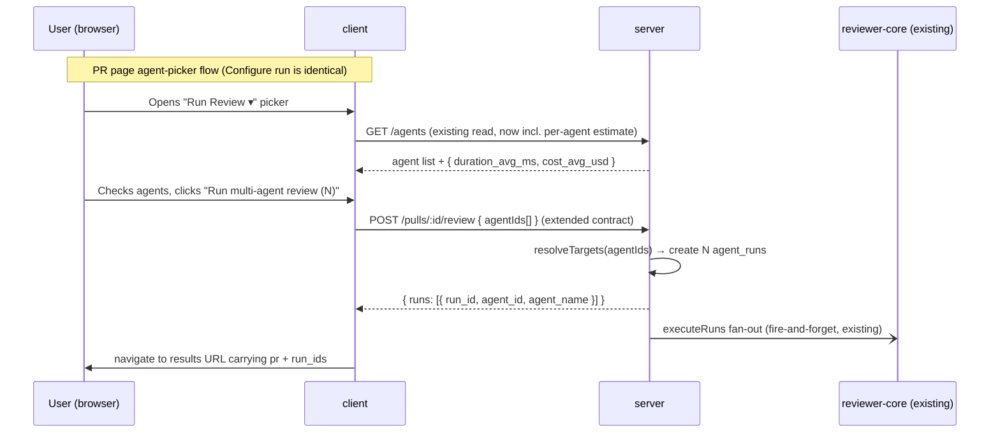
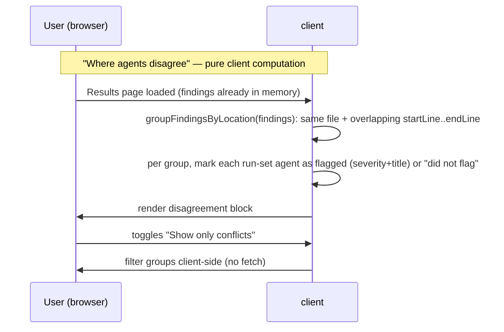

# Spec: Multi-Agent Review — Worktree A  |  Spec ID: SPEC-05  |  Status: implemented
Supersedes: —
Modules: server, client

## Problem & why

Running a single agent on a PR leaves reviewers blind to the specialisation gap: a security-focused agent misses performance issues and vice versa. Users have no way to fan multiple agents out over the same PR in one operation, compare what each flagged, or see where they disagree — which is where the most actionable signal lives.

The connective tissue already exists and is deliberately reused: `POST /pulls/:id/review` + `ReviewRunExecutor.executeRuns` already fan out multiple agents with per-agent failure isolation and return one `run_id` per agent; `useRunEvents(runIds[])` already streams multiple SSE runs; `RunTraceDrawer` already renders a single run's trace keyed by `run_id`. **A "multi-agent run" is therefore just the SET of `run_id`s produced by one fan-out** — carried in the results-page URL, with no new persistence layer. The missing layer is UI (agent picker, Configure page, results page, cross-agent grouping) plus one small contract extension.

## Simplicity stance (why this is a small build)

- **No new table, no migration.** The multi-run is the run-id set in the URL. `multi_agent_runs` stays an untouched stub; `agent_runs` is unchanged. (Migrations here are not applied on boot — avoiding one removes real setup/CI friction.)
- **No new multi-run routes.** Launch reuses `POST /pulls/:id/review`; the results page reuses the existing per-PR run list + per-run SSE/trace reads, filtered to the URL's run-id set.
- **Cross-agent grouping is a pure client function** over findings the page already loaded — no server grouping route.
- **Pre-run estimates fold into the existing `GET /agents` read** — no dedicated estimates route.
- **Only one server change:** extend the `RunRequest` contract with `agentIds[]` so the picker can pass a chosen subset.

## Goals / Non-goals

**Goals:**
- Replace the single-agent RunReviewDropdown on the PR page with an agent-picker popover that lets users choose a subset of agents and launch a multi-agent run in one click, then navigate to the results page.
- Provide a "Configure run" page where users select a PR and agents, see pre-run per-agent time/cost estimates drawn from historical runs, a summary line, and a launch button.
- Show multi-run results on a dedicated page addressed by `pr` + the run-id set, with two interchangeable views: **Columns** (one column per agent, live status, score, "View trace") and **Tabs + detail** (per-agent tab with finding detail, Accept/Dismiss, and forward-hook stubs for Learn / Turn into eval case).
- "View trace" in both views opens the existing `RunTraceDrawer` keyed by the agent's `run_id`, with its existing panels (Configuration, Stats, Findings, Prompt Assembly, Tool calls, Raw output) and the Live log tab. The drawer SHALL be promoted to a shared client location so both the PR page and the results page import it without duplication.
- Show a "Where agents disagree" block below both views, grouping findings by overlapping file+line-range across agents that ran in THIS run-set, with a "did not flag" cell (no rationale text) for agents that produced no finding at that location, plus a "Show only conflicts" toggle. Grouping is computed client-side.
- Add a "Multi-Agent Review" nav item linking to the Configure run page.

**Non-goals:**
- A durable `multi_agent_runs` entity / a list of past multi-runs — deferred; a multi-run is represented by its run-id set in the URL only.
- The "Compose review" drawer (curates and publishes findings to GitHub) — fully out of scope.
- Changes to `ci/` engine or `agent-runner/` — worktree A touches only server (`RunRequest` + estimate read) and client.
- Real "did not flag" rationale text (requires engine changes) — cells show the label only, no explanation.
- Embedding-based or title-similarity matching for cross-agent grouping — v1 uses file + line-range overlap only.
- Agent Performance page — downstream homework; its nav item is NOT added here.
- A "1 vs 3 cost comparison" UI surface — the economics measurement is a manual validation scenario, not a built feature.
- Per-run agent descriptions drawn from a prior verdict on the specific PR — v1 uses the agent's static `description` field in the Configure run card.
- The `Learn` and `Turn into eval case` finding actions as wired features — rendered as stubs with clear TODOs (Learn → Memory homework; Turn into eval case → L06 evals).
- A combined/PR-level score aggregated across agents — per-agent score badges only.

## User stories

- **US-1** — As a developer, I want to pick a specific subset of agents and launch them all on a PR in one action, so that I get specialised perspectives without running agents one by one.
- **US-2** — As a developer, I want to see estimated time and cost per agent before launching a multi-run, so that I can decide which agents to include.
- **US-3** — As a developer, I want to watch each agent's column update live as the run progresses, so that I can read early results without waiting for all agents to finish.
- **US-4** — As a developer, I want to see where agents disagree on the same code location, including agents that ran but did not flag it, so that I can identify genuinely uncertain or controversial code areas.
- **US-5** — As a developer, I want to view an individual finding's confidence, rationale, and suggested fix, and accept or dismiss it, so that I can act on multi-agent findings without leaving the results page.
- **US-6** — As a developer, I want a stable, shareable URL for a multi-agent run's results, so that I can revisit or share it; the URL carries the run-id set, and the runs persist as normal `agent_runs`.

## Acceptance criteria (EARS)

- **AC-1** — WHEN the user opens the "Run Review" trigger on the PR page, the system SHALL display an agent-picker popover listing every enabled workspace agent with a checkbox, its name, and a pre-run time estimate; pre-checked to all enabled agents (or the last selection). (covers: US-1, US-2)
- **AC-2** — WHEN the user checks one or more agents and clicks "Run multi-agent review (N)", the system SHALL POST to `POST /pulls/:id/review` with `agentIds` = the checked set, receive the `run_ids`, and navigate to the results page carrying `pr` and the run-id set in the URL. (covers: US-1, US-6)
- **AC-3** — WHEN the Configure run page loads with no PR selected, the system SHALL render the agent-selection panel in a disabled/empty state with placeholder text instructing the user to pick a PR first. (covers: US-1, US-2)
- **AC-4** — WHEN the user selects a PR on the Configure run page, the system SHALL populate the agent list with per-agent cards (name, static description, estimated duration, estimated cost) and SHALL show a summary line below the launch button with **time ≈ max(selected)** and **cost = sum(selected)**. (covers: US-2)
- **AC-5** — WHEN an agent has no prior successful runs, the system SHALL display "~?" for its time estimate and "~$?" for its cost estimate in both the picker popover and the Configure run card. (covers: US-2)
- **AC-6** — WHEN the user clicks "Run multi-agent review (N)" on the Configure run page, the system SHALL behave identically to AC-2 (POST with `agentIds`, receive `run_ids`, navigate to the results URL). (covers: US-1, US-6)
- **AC-7** — WHILE a run is in progress, the system SHALL update each agent's column header on the results page to reflect the agent's current SSE-streamed status (running / done / failed / cancelled) without a full page reload. (covers: US-3)
- **AC-8** — WHEN the results page loads in Columns view, the system SHALL display one column per `run_id` in the URL set, each showing: agent name, live status, per-agent score badge (from the run's `score`), finding cards (severity + title + file:line), and a "View trace" link. (covers: US-3, US-5)
- **AC-9** — WHEN the user clicks "View trace" in a column header or a tab's summary banner, the system SHALL open the shared `RunTraceDrawer` keyed by that agent's `run_id`, passing the agent's already-loaded findings as a prop (no separate findings fetch). (covers: US-3, US-5)
- **AC-10** — WHILE an agent's run is in progress, the drawer SHALL default to the Live log tab (streaming the existing `GET /runs/:id/events`); WHEN the run reaches a terminal status, the drawer SHALL show the trace tab with assembled prompt blocks (system, skills, memory, repo_map, specs, callers, user), token counts, per-call cost, and the grounding badge. (covers: US-3)
- **AC-11** — WHEN the `RunTraceDrawer` is opened for a `failed` or `cancelled` run, the system SHALL render whatever trace/log data exists without crashing, surfacing the error message and the log collected up to the failure point. (covers: US-3)
- **AC-12** — WHEN the user toggles to Tabs view, the system SHALL display one tab per agent with a summary banner (score, one-line summary, View trace, time, cost) and a scrollable list of that agent's finding cards. (covers: US-5)
- **AC-13** — WHEN the user expands a finding in Tabs view, the system SHALL display: title, category tag, file:line, confidence percentage, rationale, suggested fix, and action buttons Accept, Dismiss, Learn (stub), Turn into eval case (stub). (covers: US-5)
- **AC-14** — WHEN the user clicks Accept or Dismiss on a finding, the system SHALL call the existing finding action endpoints (`POST /findings/:id/accept` or `/findings/:id/dismiss`) and update the finding's visual state on success. (covers: US-5)
- **AC-15** — WHEN the results page renders, the system SHALL display a "Where agents disagree" block below the active view, grouping findings client-side by location (same file, overlapping `startLine..endLine` across the agents in the URL run-set). Each group SHALL show one cell per participating agent: either the finding's severity + title, or "did not flag" (no rationale text) if that agent produced no overlapping finding. (covers: US-4)
- **AC-16** — WHEN the "Show only conflicts" toggle is ON, the system SHALL hide groups where the flag/no-flag pattern is uniform across agents, showing only groups where it differs. (covers: US-4)
- **AC-17** — IF one agent in the run-set reaches `failed` or `cancelled`, THEN the system SHALL still display all other agents' results and SHALL render the failed agent's column/tab in an error state showing the error message. (covers: US-3, US-4)
- **AC-18** — IF no enabled agents exist, THEN the picker and Configure run page SHALL render an empty agent list with a call-to-action linking to `/agents`, and the "Run multi-agent review" button SHALL be disabled. (covers: US-1)
- **AC-19** — IF no pull requests exist for the workspace's repos, THEN the Configure run page SHALL render a disabled PR selector with placeholder text. (covers: US-1)
- **AC-20** — WHEN a pre-run estimate is computed for an agent, the system SHALL average `duration_ms` and computed cost (`tokens_in`/`tokens_out` via PriceBook) over that agent's last 3 successful (`status='done'`) `agent_runs` across any PR; the estimate SHALL be supplied by the existing `GET /agents` read (no dedicated estimates route). (covers: US-2)
- **AC-21** — The system SHALL extend the `RunRequest` contract with an optional non-empty `agentIds: string[]`; WHEN present it takes precedence over `all`, and `ReviewService.runReview` SHALL fan out one `agent_run` per id and return the `run_ids`. Exactly one of `agentId`, `all: true`, or `agentIds` SHALL be present (else 400). (covers: US-1)
- **AC-22** — The system SHALL add a "Multi-Agent Review" entry to the sidebar nav pointing to the Configure run page. (covers: US-1)
- **AC-23** — WHEN the results page is loaded for a run-set still in progress, the system SHALL show completed agents' full results immediately and continue streaming the remaining agents' SSE events until all reach a terminal status. (covers: US-3)

## Verification hints

- AC-1 — hermetic unit: render the picker popover with a mocked agent list (incl. estimates); assert checkboxes and estimate values render.
- AC-2 — hermetic unit: clicking "Run multi-agent review (2)" POSTs `agentIds` to `/pulls/:id/review`; assert navigation to the results URL with the returned run ids.
- AC-3 — hermetic unit: Configure run page without a PR renders the agent panel disabled.
- AC-4 — hermetic unit: selecting a PR renders per-agent cards and the summary line (max time, sum cost) from mocked estimates.
- AC-5 — hermetic unit: an agent with no history shows "~?" / "~$?" in card and picker row.
- AC-6 — e2e/flow: visit Configure run, pick a PR, check two agents, run, assert navigation to results URL.
- AC-7 — hermetic unit: simulate SSE events for two run ids; assert column status labels update reactively.
- AC-8 — hermetic unit: results page (Columns) with mocked per-run data renders one column per run id with score badge + finding cards.
- AC-9 — hermetic unit: "View trace" opens the shared `RunTraceDrawer` with the correct `runId` and findings prop; assert no extra findings fetch.
- AC-10 — hermetic unit: drawer with `running=true` defaults to log tab; `running=false` defaults to trace tab with prompt blocks.
- AC-11 — hermetic unit: drawer with a failed run's partial trace renders the error without throwing.
- AC-12 — hermetic unit: toggling to Tabs view renders one tab per agent with the summary banner.
- AC-13 — hermetic unit: expanding a finding renders confidence, rationale, suggested fix, and all four action buttons.
- AC-14 — DB-backed `*.it.test.ts`: POST `/findings/:id/accept` stamps `accepted_at`.
- AC-15 — hermetic unit: a mocked run-set with two agents overlapping on the same file+line renders one group with two cells; a "did not flag" cell for an agent without an overlapping finding.
- AC-16 — hermetic unit: "Show only conflicts" ON hides uniform groups; mixed groups remain.
- AC-17 — hermetic unit: results page with one run `status='failed'` renders an error state in that column/tab while others show results.
- AC-18 — hermetic unit: empty agent list renders the `/agents` CTA and disables the run button.
- AC-19 — hermetic unit: empty PR list renders a disabled PR selector.
- AC-20 — DB-backed `*.it.test.ts`: insert 5 `agent_runs` (3 done + 2 failed) for an agent; assert `GET /agents` returns the estimate averaged over the 3 done rows only.
- AC-21 — DB-backed `*.it.test.ts`: `POST /pulls/:id/review` with `agentIds:[a,b]` creates two `agent_runs` and returns two run ids; a body with none of the three fields returns 400.
- AC-22 — hermetic unit: the `NAV` constant includes a "Multi-Agent Review" entry.
- AC-23 — hermetic unit: results page with one run `done` and one `running` renders the done column fully and the running column in live-streaming state.

## Edge cases

- **Zero findings from one agent** — its column/tab renders an explicit "No findings" empty state; the agent still appears in "Where agents disagree" (all its cells are "did not flag").
- **All agents produce zero findings** — the disagreement block renders an empty state (e.g. "All agents agree — no conflicting locations"), not a blank area.
- **All agents agree on every location** — with "Show only conflicts" ON, the block renders the empty-conflicts state, not silently zero groups.
- **Single agent selected** — valid; results page renders a single column/tab; the disagreement block renders its empty state (no cross-agent data).
- **A `run_id` in the URL does not exist / belongs to another workspace** — the existing run-scoped reads (`listRuns`, `/runs/:id/*`) enforce workspace scoping; a missing/foreign run renders that column in a not-found/error state; a fully invalid set renders a "not found" page consistent with existing 404 patterns.
- **Run still in-flight when page loads** — running `agent_runs` have `status='running'`; AC-23 governs this; the page renders available results without waiting for all.
- **Pre-run estimate with partial history** — fewer than 3 successful runs → average over however many exist (1 or 2); only show "~?/~$?" when count = 0.
- **Unknown model in PriceBook** — computed cost is null; estimate and results show "—"/"unknown", consistent with the existing `listRuns` pattern.
- **Concurrent multi-runs for the same PR** — permitted; each launch produces a distinct run-id set / distinct results URL; Configure run always launches a new fan-out.
- **Agent deleted after the run started** — `agent_runs.agent_id` may be null; the column falls back to the agent name captured on the run (as returned by the existing run list) rather than a blank.
- **"View trace" for a failed/partial run** — the executor persists a partial trace on failure/cancel; the drawer opens and shows whatever exists plus `agent_runs.error` in the log tab; it SHALL NOT crash or blank out (AC-11).

## Non-functional

- **Performance:** the folded estimate reads at most 3 rows per agent (≤ ~30 rows for a typical ≤10-agent workspace) — a single batched query grouped by agent; the `GET /agents` response SHALL stay within its existing latency budget (< 500 ms under normal load).
- **Security:** all run/finding reads are workspace-scoped via the existing `getContext` on `POST /pulls/:id/review`, `listRuns`, `/runs/:id/*`, and the finding action routes; no new unscoped surface is added. The results page holds no privileged data beyond what these existing scoped reads return.
- **Untrusted inputs:** agent `description`, finding `rationale`/`suggestion` are user- or model-authored and rendered as display text only (no innerHTML). The existing `wrapUntrusted` / `INJECTION_GUARD` boundary already guards model text before it reaches the DB; the client must not bypass it by rendering raw HTML.
- **Accessibility:** the Columns/Tabs toggle and the "Show only conflicts" toggle SHALL be keyboard-operable (focusable, Space/Enter) with ARIA roles consistent with existing toggles.
- **Nav shortcut:** the "Multi-Agent Review" nav item MAY take a `gKey` (e.g. "m") if free in the SHORTCUTS registry; omit rather than collide.

## Flows & interactions



```mermaid
sequenceDiagram
    participant U as User (browser)
    participant C as client
    participant S as server

    note over U,C: Results page — live updates + trace (no new routes)
    U->>C: Loads results URL (pr + run-id set)
    C->>S: GET per-PR run list (existing listRuns) → filter to URL run ids
    C->>S: GET findings for those runs (existing per-PR/per-run read)
    S-->>C: per-run status/score/cost/findings_count + finding rows
    loop per run_id in the URL set
        C->>S: GET /runs/:run_id/events (SSE, existing)
        S-->>C: RunEvents stream → column status updates
    end
    U->>C: Clicks "View trace"
    C->>U: opens shared RunTraceDrawer keyed by run_id (findings passed as prop)
    note over C,S: running → log tab via SSE; completed → GET /runs/:id/trace (existing)
```



## Contracts

### Modified: RunRequest (existing, `@devdigest/shared`)

| Field | Type | Semantics |
| --- | --- | --- |
| agentId | string, optional | Single agent id (existing) |
| all | boolean, optional | Run all enabled agents (existing) |
| agentIds | string[], optional | Run a specific subset; non-empty when present; takes precedence over `all` |

Exactly one of `agentId`, `all: true`, or `agentIds` (non-empty) SHALL be present; a body satisfying none is rejected with 400. Response is the existing `{ pr_id, runs: [{ run_id, agent_id, agent_name }], reviews: [] }` — one entry per fanned-out agent.

### Modified: GET /agents response (existing read)

Each agent object gains an optional estimate (computed at read time, not stored):

| Field | Type | Semantics |
| --- | --- | --- |
| estimate.duration_avg_ms | number \| null | Avg `duration_ms` over the agent's last 3 `status='done'` runs; null when no history |
| estimate.cost_avg_usd | number \| null | Avg computed cost (via PriceBook) over the same runs; null when no history |

No new route. If wiring the estimate into `GET /agents` proves awkward at implementation time, a single sibling read may be added, but the default is to fold it in.

### Unchanged / reused (no schema change)

- `agent_runs`, `multi_agent_runs` (stub) — **not modified**. No `multi_run_id`, no new columns, no migration.
- `POST /pulls/:id/review`, `GET /runs/:id/events`, `GET /runs/:id/trace`, per-PR run list (`listRuns`), finding accept/dismiss — reused as-is.

### Cross-agent grouping — placement

The grouping logic (overlapping file+line across a flat list of `{ findingId, agentId, file, startLine, endLine }` → grouped structure with per-agent flagged / did-not-flag cells) SHALL live as a **pure client helper** (e.g. `client/src/.../_lib/groupFindingsByLocation.ts`), no I/O, no server round-trip — unit-testable without a DB. (If a server-side canonical matcher is later needed for CI, it can be promoted; out of scope here.)

## Inputs (provenance)

- RunReviewDropdown component — [reused: existing client component, replaced by the multi-agent picker popover]
- `POST /pulls/:id/review` + `ReviewService.runReview` + `ReviewRunExecutor.executeRuns` — [reused: existing parallel execution; `RunRequest` contract extended with `agentIds[]`]
- `GET /agents` read — [reused: existing; response extended with a computed per-agent `estimate`]
- Per-PR run list (`ReviewService.listRuns`) — [reused: existing; filtered client-side to the URL run-id set]
- `useRunEvents(runIds: string[])` hook — [reused: existing; already fans out over multiple SSE streams]
- `RunTraceDrawer` component + children — [reused: existing; promoted to a shared client location, opened from column/tab "View trace"]
- Finding accept/dismiss endpoints — [reused: existing `POST /findings/:id/accept` and `/findings/:id/dismiss`]
- PriceBook — [reused: existing read-time cost computation pattern]
- NAV constant in `client/src/vendor/ui/nav.ts` — [reused: existing; new "Multi-Agent Review" entry appended]
- `groupFindingsByLocation` — [new: pure client helper, deterministic, 0 LLM calls]
- Multi-Agent Review results page + Configure run page + agent-picker popover — [new: client only, 0 LLM calls]

Total new LLM calls introduced by this feature: **0**. All new mechanics are deterministic (a read-time DB average, pure client computation, reuse of existing SSE relay).

## Untrusted inputs

The results page surfaces third-party / model-generated text:

- **Finding rationale and suggestion** (AC-13) — LLM-generated; rendered as display text only. The existing `wrapUntrusted` / `INJECTION_GUARD` boundary already guards these fields before the DB; the client must not render raw HTML.
- **Agent description** (Configure run card) — user-authored; rendered as display text.
- **PR title and number** (Configure step 1, results header) — imported from GitHub; already treated as data, not commands.

No new untrusted-input surface is introduced beyond those governed by the existing `INJECTION_GUARD` convention.

## Resolved during implementation

- **Results URL shape:** shipped as `/multi-agent-review/results?pr=<prId>&runs=<r1,r2,…>` — query params on a static route, avoiding a static/dynamic route collision with the Configure page at `/multi-agent-review`.
- **Nav gKey:** `g m` assigned (free in the SHORTCUTS registry) — see `client/src/vendor/ui/nav.ts`.

## Deferred to manual verification (test-writer disabled)

- **AC-20 / AC-21 server integration tests:** the estimate-averaging read (`GET /agents`) and the `agentIds[]` fan-out + 400 path (`POST /pulls/:id/review`) are implemented and unit-covered on the client side, but their DB-backed `*.it.test.ts` (Docker/Postgres) were not authored. Author them when the eval/integration lane is next touched.
