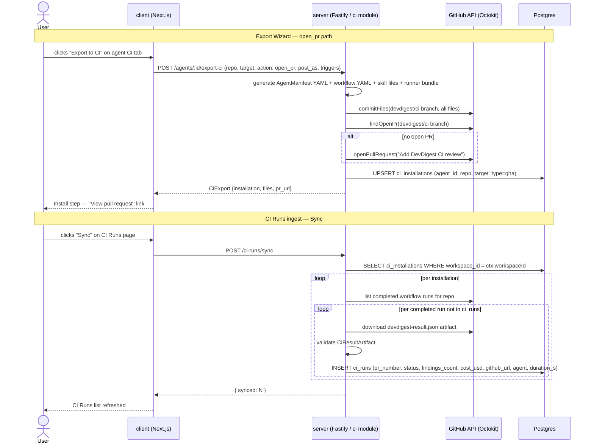
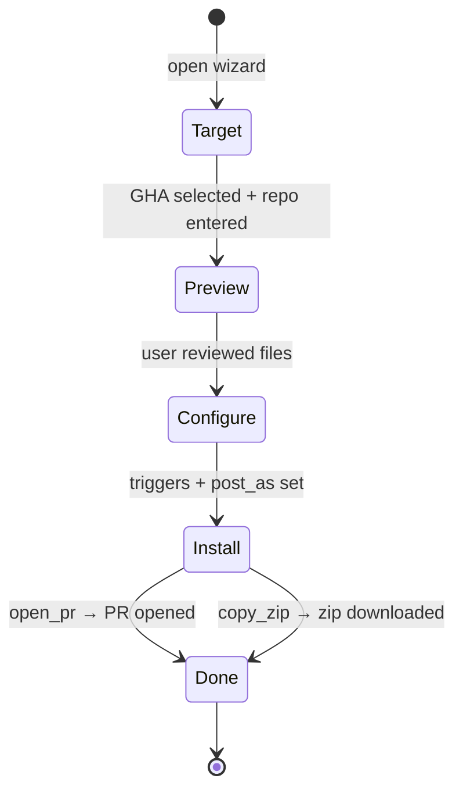
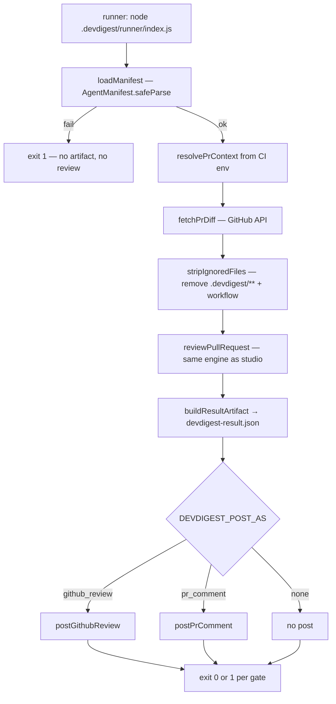

# Spec: Export to CI  |  Spec ID: SPEC-06  |  Status: implemented
Supersedes: —
Modules: server, client, shared

## Problem & why

DevDigest's review agents are tuned in the studio — prompt, model, skills, gate threshold — but that tuning has no path into a team's real code review flow. Engineers must run reviews manually and locally, so CI is unaware of agent decisions, merge quality is ungated, and agent config can diverge silently between "what the studio used" and "what CI runs". Export to CI closes the loop: it serialises the agent's live config into a YAML manifest, generates a self-contained GitHub Actions workflow that embeds the bundled agent-runner, and opens a PR in the target repository — one artifact, byte-for-byte identical, in both environments. Results flow back into the studio via GitHub artifact pull, so the CI Runs page shows every automated review alongside its cost, verdict, and findings count.

## Goals / Non-goals

**Goals:**
- Let a user launch a 4-step Export Wizard (Target → Preview → Configure → Install) from the agent's CI tab and export the agent to GitHub Actions.
- Generate an atomic, self-contained CI bundle: the agent manifest (`AgentManifest` YAML), referenced skill files, an empty `.devdigest/memory.jsonl` stub, the bundled agent-runner (`dist/index.js`), and an editable GitHub Actions workflow — committed in one atomic operation to a `devdigest/ci` branch and opened as a PR in the target repository.
- The generated workflow MUST be self-contained: it runs `node .devdigest/runner/index.js` directly and does NOT reference an external marketplace action.
- The generated workflow MUST embody the security constraints: `permissions: contents: read, pull-requests: write` only; API key sourced from Actions Secrets only; fork PRs receive no secrets and the job does not run for fork PRs; no action triggers derived from PR comment content.
- Persist a `ci_installations` record on successful export; support idempotent re-export (update the existing branch/PR, do not open a second PR).
- Wire the wizard's "Post results as" choice (`github_review` | `pr_comment` | `none`) as the `DEVDIGEST_POST_AS` environment variable in the generated workflow (not in the manifest).
- Provide a CI Runs page (`/ci-runs`) that lists ingested runs from GitHub Actions, filtered by time window, agent, repo, and status.
- Provide a "Sync" action on the CI Runs page (and optional auto-poll) that pulls `devdigest-result.json` artifacts from GitHub Actions for each known installation and writes the results to `ci_runs`.
- Show a per-repo CI tab on the agent editor page: installation status, workflow version, CI-run history for that agent, and a "Fail CI on" selector that persists to the agent's stored config.
- Expose a degraded "Copy files as a zip" path on the Install step when the user cannot or does not want to open a PR.

**Non-goals:**
- CircleCI, Jenkins, and Generic CLI targets: the wizard shows them as disabled / "coming soon" but generates no files and returns no error for them.
- A server-side HTTP ingest endpoint: CI cannot reach `localhost`; ingest is always a client-initiated pull from GitHub.
- Manual file upload for CI results.
- Multi-agent review service and PR feed/stream: out of scope; do not modify those modules.
- Real-time webhook push from GitHub into the studio.
- Memory population in the exported bundle: `.devdigest/memory.jsonl` is generated as an empty file; memory injection is a later lesson.
- Verifying that the `OPENROUTER_API_KEY` secret exists in the target repo: the wizard displays a note instructing the user to add it; it does not verify it.
- Publishing or versioning the agent-runner as a marketplace GitHub Action (`uses: devdigest/review-action@v1` is a placeholder shown in the Preview step only).

## User stories

- **US-1** — As an agent author, I want to open an Export Wizard from the agent's CI tab, so that I can deploy the agent to GitHub Actions without manually writing workflow YAML or copying manifests.
- **US-2** — As an agent author, I want to preview every file that will be committed before opening the PR, and be able to edit the workflow YAML inline, so that I can verify the security posture before anything lands in the target repo.
- **US-3** — As an agent author, I want to configure pull-request triggers and the "Post results as" mode before installing, so that the agent behaves exactly as I expect on each PR event.
- **US-4** — As an agent author, I want the wizard to open a PR in the target repository atomically, so that the exported config goes through review like any code change and never lands on `main` directly.
- **US-5** — As an agent author, I want to re-export after changing the agent's prompt or model and have the wizard update the existing `devdigest/ci` PR rather than opening a second one, so that the installation stays in sync without manual cleanup.
- **US-6** — As an agent author, I want a "Copy files as a zip" fallback on the Install step, so that I can install manually on repos where I cannot open PRs programmatically.
- **US-7** — As a reviewer, I want to see all CI-originated runs in a CI Runs page with PR number, repository, agent, verdict, findings count, cost, duration, and a link to the Actions job, so that I have a central audit trail of automated reviews.
- **US-8** — As a reviewer, I want to sync CI runs from GitHub (manually or via auto-poll), so that the studio ingests the `devdigest-result.json` artifact produced by the agent-runner and the run appears in the CI Runs page.
- **US-9** — As an agent author, I want the agent's CI tab to show the installation status per repo and let me set "Fail CI on" (never / critical / warning / any), so that I can tune merge-blocking behaviour from the studio.

## Acceptance criteria (EARS)

### Export Wizard — Target step

- **AC-1** — WHEN a user opens the Export Wizard and selects the "GitHub Actions" target, the system SHALL enable the Continue button and show the target repository input field. (covers: US-1)
- **AC-2** — WHEN a user selects any target other than "GitHub Actions" (CircleCI, Jenkins, Generic CLI), the system SHALL show those targets as disabled with a "coming soon" indicator and SHALL NOT enable the Continue button for those targets. (covers: US-1)
- **AC-3** — IF a user attempts to continue from the Target step without entering a target repository in `owner/name` format, the system SHALL prevent navigation to the Preview step and SHALL display a validation message. (covers: US-1)

### Export Wizard — Preview step

- **AC-4** — WHEN the wizard advances to the Preview step, the server SHALL return a `CiExport` preview payload containing at minimum: `.devdigest/agents/<slug>.yaml` (non-editable), one `.devdigest/skills/<slug>.md` per enabled skill linked to the agent (non-editable), `.devdigest/memory.jsonl` (empty, non-editable), `.devdigest/runner/index.js` (the ncc-bundled agent-runner, non-editable), and `.github/workflows/devdigest-review.yml` (editable). (covers: US-2)
- **AC-5** — WHEN the wizard renders the Preview step, the system SHALL display each file's path and contents; the `.github/workflows/devdigest-review.yml` file SHALL be rendered in an editable text area that allows the user to modify the workflow before export. (covers: US-2)
- **AC-6** — The system SHALL generate the `.devdigest/agents/<slug>.yaml` file content by serialising the fields of `AgentManifest` (name, provider, model, system_prompt, skills array of slugs, strategy, ci_fail_on) from the agent's current saved configuration. (covers: US-1, US-2)

### Export Wizard — Configure step

- **AC-7** — WHEN the wizard renders the Configure step, the system SHALL display trigger checkboxes for `opened`, `synchronize`, and `reopened`; `opened` and `synchronize` SHALL be pre-checked and SHALL NOT be deselectable; `reopened` SHALL be optional. (covers: US-3)
- **AC-8** — WHEN the wizard renders the Configure step, the system SHALL display a "Post results as" selector with three options: "GitHub review" (pre-selected, recommended), "PR comment", and "None (exit code only)"; the selected value SHALL be reflected as `DEVDIGEST_POST_AS` in the generated workflow's `env:` block — NOT in the manifest YAML. (covers: US-3)

### Export Wizard — Install step and export endpoint

- **AC-9** — WHEN a user activates the "Open a PR with these files" action on the Install step, the client SHALL call `POST /agents/:id/export-ci` with the configured repo, triggers, post_as, and base branch; the server SHALL commit all generated files to the `devdigest/ci` branch in the target repository via the GitHub Git Data API in a single atomic commit, and SHALL return the PR URL. (covers: US-4)
- **AC-10** — WHEN `POST /agents/:id/export-ci` succeeds and no open PR exists for the `devdigest/ci` branch in the target repository, the server SHALL open a new pull request titled "Add DevDigest CI review" and SHALL persist a `ci_installations` record with `target_type = 'gha'`. (covers: US-4)
- **AC-11** — WHEN `POST /agents/:id/export-ci` is called and an open pull request already exists for the `devdigest/ci` branch in the target repository, the server SHALL commit the updated files to that branch without opening a second PR, and SHALL return the URL of the existing PR. (covers: US-5)
- **AC-12** — WHEN a user activates the "Copy files as a zip" action on the Install step, the server SHALL return the same generated file set as a zip archive download and SHALL NOT persist a `ci_installations` record or open any PR. (covers: US-6)
- **AC-13** — IF `POST /agents/:id/export-ci` fails because the GitHub API returns an error (e.g. repository not found, insufficient permissions), the server SHALL return HTTP 502 with a descriptive error message and SHALL NOT persist a `ci_installations` record. (covers: US-4)

### Generated workflow security constraints

- **AC-14** — The generated `.github/workflows/devdigest-review.yml` SHALL declare `permissions: contents: read` and `pull-requests: write` at the job or workflow level, and SHALL NOT declare any additional permission scopes. (covers: US-4, US-2)
- **AC-15** — The generated workflow SHALL source `OPENROUTER_API_KEY` exclusively from `${{ secrets.OPENROUTER_API_KEY }}`; the key value SHALL NOT appear in the workflow file, the manifest, or any other generated file. (covers: US-4, US-2)
- **AC-16** — The generated workflow SHALL include a condition that prevents it from running on pull requests from forks (e.g. `if: github.event.pull_request.head.repo.full_name == github.repository`), so that fork PRs never receive the secret. (covers: US-4, US-2)
- **AC-17** — The generated workflow SHALL NOT contain any `on: issue_comment` or similar trigger that derives execution from PR or issue comment content. (covers: US-4)

### Agent manifest fidelity

- **AC-18** — The system SHALL use the single shared `AgentManifest` Zod schema for both generating the manifest YAML on export and validating the manifest file at agent-runner load time; the two environments SHALL use the same schema, byte-for-byte, so CI and local review are config-identical. (covers: US-1, US-4)
- **AC-19** — WHEN the agent-runner loads the manifest, IF the YAML file fails `AgentManifest` Zod validation, THEN the runner SHALL exit with code 1 and SHALL NOT post any review or write a `devdigest-result.json` artifact. (covers: US-4)

### CI Runs page

- **AC-20** — WHEN a user navigates to `/ci-runs`, the system SHALL render a page titled "CI Runs" listing all `ci_runs` rows in the workspace, each showing: timestamp, PR number, repository, agent name, status badge, findings count, cost, and a link to the GitHub Actions job URL. (covers: US-7)
- **AC-21** — WHEN the CI Runs page renders with no ingested runs, the system SHALL display an empty state message indicating that no CI runs exist yet and prompting the user to export an agent. (covers: US-7)
- **AC-22** — WHEN a user applies any combination of the available filters (last 7 days, agent, repo, status), the client SHALL re-query `GET /ci-runs` with the corresponding query parameters and re-render the list. (covers: US-7)

### CI Runs ingest (sync / auto-poll)

- **AC-23** — WHEN a user activates the "Sync" action on the CI Runs page, the server SHALL query the GitHub Actions API for completed workflow runs on each known `ci_installations` repo, download the `devdigest-result.json` artifact from each completed run not yet recorded in `ci_runs`, validate each artifact against `CiResultArtifact`, and persist a new `ci_runs` row for each valid artifact — populating `agent`, `duration_s`, `github_run_id`, and the `critical` / `warning` / `suggestion` severity counts from the artifact. (covers: US-8)
- **AC-24** — WHILE the CI Runs page is open, the client SHALL auto-poll `GET /ci-runs` at a 60-second interval so newly ingested runs appear without a manual refresh. (covers: US-8)
- **AC-25** — IF a downloaded artifact fails `CiResultArtifact` validation during sync, the server SHALL log the failure and SHALL skip that artifact without creating a partial `ci_runs` row or returning an error to the client. (covers: US-8)
- **AC-26** — IF the GitHub API returns a rate-limit or transient error during sync, the server SHALL return HTTP 502 with a descriptive error; already-ingested rows for that sync session SHALL be committed to the database and SHALL NOT be rolled back. (covers: US-8)

### Agent CI tab

- **AC-27** — WHEN a user opens the CI tab on the agent editor page, the system SHALL render, for each repo in the workspace that has a `ci_installations` record for this agent: the installation date, target type badge, and a link to the export PR. (covers: US-9)
- **AC-28** — WHEN the agent CI tab renders and the agent has no `ci_installations` records, the system SHALL display an empty state and the "Export to CI" button. (covers: US-9)
- **AC-29** — WHEN a user changes the "Fail CI on" selector on the CI tab and saves, the server SHALL update the `ci_fail_on` field on the agent row; the next export of this agent SHALL use the updated value in the generated manifest. (covers: US-9)
- **AC-30** — WHEN the CI tab renders, the system SHALL show the CI-run history for this agent (calls `GET /ci-runs?agent_id=:id`) in a compact list with the same columns as the CI Runs page. (covers: US-9)

### Untrusted-input boundary in the agent-runner

- **AC-31** — The system SHALL supply the PR diff and PR description obtained from the GitHub API to `reviewPullRequest` through the same `wrapUntrusted` and `INJECTION_GUARD` path as a local studio review, treating both as data, not commands. (covers: US-4)
- **AC-32** — The system SHALL strip `.devdigest/**` and the generated workflow file from the diff before passing it to `reviewPullRequest`, so the agent-runner bundle and config files are never included in the review payload. (covers: US-4)

## Verification hints

- AC-1, AC-2, AC-3 — component test (`ExportWizard.test.tsx`): render the wizard at step 1; assert GHA target enables Continue; assert non-GHA targets render with a "coming soon" indicator and Continue stays disabled; assert blank repo field blocks Continue.
- AC-4, AC-5 — component test: mock `POST /agents/:id/export-ci` with a `CiExport` fixture containing the five file types; render step 2 (Preview); assert all file paths appear and the workflow file is in an editable textarea.
- AC-6 — DB-backed `*.it.test.ts`: seed an agent with known model/system_prompt/skills; call the preview endpoint; parse the returned manifest YAML; assert all `AgentManifest` fields match the seeded agent.
- AC-7 — component test: render Configure step; assert `opened` and `synchronize` checkboxes are checked and disabled; assert `reopened` is unchecked and enabled.
- AC-8 — component test: render Configure step; select "PR comment"; assert the generated workflow textarea (or a preview derived from it) contains `DEVDIGEST_POST_AS: pr_comment` and the manifest YAML does NOT contain `post_as`.
- AC-9, AC-10 — DB-backed `*.it.test.ts` with mock GitHub adapter: call `POST /agents/:id/export-ci` with `action: 'open_pr'`; assert `commitFiles` and `openPullRequest` were called; assert a `ci_installations` row exists; assert the response contains `pr_url`.
- AC-11 — DB-backed `*.it.test.ts` with mock GitHub adapter: pre-configure `findOpenPr` to return an existing URL; call the export endpoint again; assert `openPullRequest` was NOT called a second time; assert only one `ci_installations` row exists.
- AC-12 — DB-backed `*.it.test.ts`: call export with `action: 'files'`; assert response is a zip binary; assert no `ci_installations` row was created; assert `openPullRequest` was not called.
- AC-13 — DB-backed `*.it.test.ts`: mock GitHub adapter to throw on `commitFiles`; assert HTTP 502 response; assert no `ci_installations` row created.
- AC-14, AC-15, AC-16, AC-17 — hermetic unit (`workflow.test.ts`): call the workflow generator with a sample config; parse the resulting YAML; assert `permissions` block has exactly `contents: read` and `pull-requests: write`; assert `OPENROUTER_API_KEY` value is the Secrets expression; assert the fork-guard `if:` condition is present; assert no `issue_comment` trigger.
- AC-18 — hermetic unit (`manifest.test.ts`): generate a manifest from a known agent config and immediately parse it through `AgentManifest.safeParse`; assert no validation errors.
- AC-19 — hermetic unit (agent-runner `manifest.test.ts`): supply a YAML file missing `model`; call `loadManifest`; assert `RunnerError` is thrown.
- AC-20, AC-21, AC-22 — component test (`CiRunsPage.test.tsx`): mock `GET /ci-runs` with fixture rows; assert all columns render; mock with empty array; assert empty state renders; simulate filter change; assert the query param is updated.
- AC-23 — DB-backed `*.it.test.ts`: seed a `ci_installations` row; mock GitHub Actions API to return one completed run with a valid artifact; call `POST /ci-runs/sync`; assert a `ci_runs` row was created with the artifact's fields.
- AC-24 — component test: mock `GET /ci-runs` initially returning one row; assert the hook is configured with `refetchInterval` ≤ 60 000 ms.
- AC-25 — DB-backed `*.it.test.ts`: mock artifact download to return invalid JSON; call sync; assert zero `ci_runs` rows created and no HTTP error returned.
- AC-26 — DB-backed `*.it.test.ts`: mock the GitHub API to throw a rate-limit error after the first successful artifact ingest; assert the first `ci_runs` row is committed; assert HTTP 502 is returned.
- AC-27, AC-28 — component test (`CiTab.test.tsx`): mock `GET /agents/:id/ci-installations` with one fixture; assert installation date and repo appear; mock with empty array; assert empty state and "Export to CI" button appear.
- AC-29 — DB-backed `*.it.test.ts`: call `PATCH /agents/:id` with `ci_fail_on: 'warning'`; assert the agent row is updated; call the preview endpoint; assert the manifest YAML contains `ci_fail_on: warning`.
- AC-30 — component test: mock `GET /ci-runs?agent_id=:id`; render `CiTab`; assert the run history list renders with the mocked rows.
- AC-31 — hermetic unit (agent-runner `run.test.ts` — already exists): supply a diff containing an injection attempt string; assert `reviewPullRequest` is called with the diff inside `wrapUntrusted` delimiters.
- AC-32 — hermetic unit (agent-runner `diff.test.ts` — already exists): supply a raw diff containing `.devdigest/agents/foo.yaml` and `.github/workflows/devdigest-review.yml` hunks; assert `stripIgnoredFiles` removes those paths before the diff reaches `parseUnifiedDiff`.

## Edge cases

- **`devdigest/ci` branch already exists**: `commitFiles` checks for an existing ref and updates it with a force-forward commit rather than creating a new branch; the workflow generator output replaces the previous commit. No special handling required.
- **Re-export / idempotent install**: `findOpenPr` detects an open PR for the `devdigest/ci` branch; if found, no second PR is opened (AC-11). The `ci_installations` record is upserted by `(agent_id, repo, target_type)`.
- **Fork PR with no secrets**: the `if:` condition in the generated workflow (AC-16) prevents the job from running on fork PRs. The runner never receives `OPENROUTER_API_KEY` for fork PRs; the job simply does not run.
- **Artifact not yet uploaded**: GitHub Actions artifact upload runs at the end of the job. Sync may find completed workflow runs with no artifact yet; the server SHALL skip runs that have no `devdigest-result.json` artifact and SHALL NOT create a `ci_runs` row for them.
- **Duplicate sync**: calling sync twice for the same workflow run ID SHALL NOT create duplicate `ci_runs` rows; the server SHOULD use `github_run_id` as a deduplication key when inserting.
- **Agent with zero enabled skills**: the manifest `skills` array is empty; no `.devdigest/skills/*.md` files are included in the bundle. The runner handles this correctly (empty skills list is valid per `AgentManifest`).
- **Agent with many skills**: each enabled linked skill becomes one `.devdigest/skills/<slug>.md` file in the bundle; there is no enforced upper limit, but large bundles increase PR diff size.
- **User edits the workflow YAML on the Preview step**: the server MUST accept the edited workflow content verbatim in the `files` field of the export request. The server SHALL NOT re-generate the workflow and overwrite user edits after Preview.
- **GitHub token missing or expired at export time**: `commitFiles` will throw; the server returns HTTP 502 (AC-13); no installation row is created.
- **`ci_runs` table missing display columns**: an additive migration SHALL add `agent` (text), `duration_s` (double precision), `github_run_id` (text), and the `critical` / `warning` / `suggestion` severity-count columns (integer) to `ci_runs` — all derived from `CiResultArtifact`. See *Resolved clarifications* (AC-33).
- **`GitHubClient` has no artifact download method**: the `GitHubClient` port SHALL be extended with GitHub Actions workflow-run listing and artifact-download methods; the CI sync service consumes them through the injected adapter, never Octokit directly (preserves the onion adapter boundary). See *Resolved clarifications* (AC-34).

## Non-functional

- **Security — lethal trifecta**: the generated workflow reads an untrusted PR diff and can write to public PR comments; the `if:` fork guard (AC-16), the minimal `permissions` block (AC-14), and the Secrets-only key reference (AC-15) together close the secret-exfiltration channel. These three constraints are non-negotiable and SHALL be enforced by the workflow generator unit test (AC-14/15/16/17 hint).
- **Security — workspace scope**: all CI routes (`POST /agents/:id/export-ci`, `GET /ci-runs`, `POST /ci-runs/sync`, `GET /agents/:id/ci-installations`, `PATCH /agents/:id`) SHALL enforce workspace scope via `getContext` before any read or write; unauthenticated or out-of-scope requests SHALL be rejected with 401 or 403.
- **Security — manifest as untrusted on-disk content**: the agent-runner validates the manifest through `AgentManifest.safeParse` before using any field; a tampered manifest file fails validation and causes a hard exit (AC-19).
- **Perf — export latency**: the export endpoint involves sequential GitHub API calls (create tree → create commit → create/find PR); total round-trip SHOULD complete within 10 seconds under normal GitHub API latency.
- **Perf — sync latency**: sync queries GitHub for each installation sequentially; for ≤10 installations under normal API conditions it SHOULD complete within 30 seconds. The endpoint is fire-and-respond (not fire-and-forget) so the client sees the final count.
- **Perf — CI Runs list**: `GET /ci-runs` with default filters SHOULD return within 300 ms for ≤500 rows.
- **a11y**: the "Export to CI" button on the CI tab SHALL be keyboard-operable and SHALL have an accessible label. Status badges on the CI Runs page SHALL NOT rely on colour alone; each badge SHALL have accessible text.
- **Observability**: response Zod schemas on all new routes SHALL be registered via `serializerCompiler` per the repo INSIGHTS requirement.

## Flows & interactions

## Contracts

New fields / resources introduced or clarified by this spec (existing `AgentManifest`, `CiExportInput`, `CiInstallation`, `CiExport`, `CiRun`, `CiResultArtifact` shapes are already in `server/src/vendor/shared/contracts/eval-ci.ts` and are not modified unless a gap is resolved):

| Resource / field | Type | Semantics |
|---|---|---|
| `POST /agents/:id/export-ci` | body: `CiExportInput` → 200 `CiExport` or 502 | Generate and optionally publish the CI bundle; `action='open_pr'` commits + opens/reuses PR; `action='files'` returns zip and skips DB write |
| `GET /agents/:id/ci-installations` | → 200 `CiInstallation[]` | All installation records for this agent |
| `GET /ci-runs` | query: `{agent_id?, repo?, status?, since?}` → 200 `CiRun[]` | Workspace-scoped CI run list with optional filters |
| `POST /ci-runs/sync` | body: `{}` → 200 `{ synced: number }` | Pull artifacts from GitHub for all known installations; returns count of newly ingested rows |
| `CiExportInput.post_as` | `'github_review' \| 'pr_comment' \| 'none'` | Already in the contract; maps to `DEVDIGEST_POST_AS` env var in the generated workflow — NOT written into the manifest YAML |
| `CiExportInput.triggers` | `string[]` | `pull_request` event types; `['opened','synchronize']` is the minimum required set |
| `CiFile.editable` | `boolean` | When true, the Preview step renders this file in an editable textarea; false files are shown read-only |
| Workflow `DEVDIGEST_POST_AS` env var | `'github_review' \| 'pr_comment' \| 'none'` | Set in the generated workflow's `env:` block from `CiExportInput.post_as`; read by the agent-runner's `resolvePostAs` at runtime |
| `ci_runs.agent` | `text \| null` | Agent name from `CiResultArtifact.agent`; stored for display on CI Runs page without a join |
| `ci_runs.duration_s` | `double precision \| null` | Duration in seconds (`CiResultArtifact.duration_ms / 1000`); stored for display |
| `ci_runs.github_run_id` | `text \| null` | GitHub Actions run id; captured during artifact download; deduplication key component |
| `ci_runs.critical` / `.warning` / `.suggestion` | `integer \| null` | Severity counts from `CiResultArtifact`; stored so the CI Runs page and agent CI tab can show a per-severity breakdown without a join |
| Deduplication key | `(ci_installation_id, github_run_id)` | Prevents duplicate `ci_runs` rows on repeated sync calls; `github_run_id` must be captured during artifact download |

**`AgentManifest` does NOT gain a `post_as` field.** The post mode is a deployment concern (how the runner presents its output in a specific repo), not an agent-identity concern (what the agent reviews and how it decides). It belongs in the workflow `env:` block. The shared `AgentManifest` Zod schema remains unchanged.

## Inputs (provenance)

- Agent config (name, provider, model, system_prompt, strategy, ci_fail_on, linked enabled skills) — [reused: existing `agents` + `agent_skills` + `skills` tables; 0 LLM calls]
- `AgentManifest` Zod schema — [reused: `server/src/vendor/shared/contracts/eval-ci.ts`; 0 LLM calls]
- `CiExportInput`, `CiFile`, `CiExport`, `CiInstallation`, `CiRun`, `CiResultArtifact` Zod contracts — [reused: same file; 0 LLM calls]
- `ciInstallations`, `ciRuns` DB tables — [reused: `server/src/db/schema/ci.ts`; 0 LLM calls]
- `agent_runs.source` enum `'ci'`, `blockers`, `findingsCount`, `grounding`, `score` columns — [reused: `server/src/db/schema/runs.ts`; 0 LLM calls — these columns exist but CI ingest writes to `ci_runs`, not `agent_runs`]
- `commitFiles`, `openPullRequest`, `findOpenPr` on `OctokitGitHubClient` — [reused: `server/src/adapters/github/octokit.ts`; 0 LLM calls]
- `agent-runner` `dist/index.js` bundle (ncc output) — [reused: `agent-runner/` package; embedded verbatim in the export bundle; 0 LLM calls]
- `runCi` + `resolvePostAs` in agent-runner reading `DEVDIGEST_POST_AS` from env — [reused: `agent-runner/src/index.ts`; 0 LLM calls]
- `ExportWizardSteps` UI primitive — [reused: `client/src/vendor/ui/ExportWizardSteps.tsx`; 0 LLM calls]
- i18n strings under `client/messages/en/ci.json` — [reused: already complete; 0 LLM calls]
- `/ci-runs` sidebar key in `client/src/components/app-shell/helpers.ts` — [reused: already wired; 0 LLM calls]

## Untrusted inputs

The following text entering the agent-runner is third-party or untrusted:

- **PR diff** (fetched from the GitHub API): attacker-controlled code changes. The runner calls `stripIgnoredFiles` to remove DevDigest's own exported files before passing the diff through `parseUnifiedDiff` and into `reviewPullRequest`, which applies `wrapUntrusted` / `INJECTION_GUARD` internally (AC-31, AC-32).
- **PR title and body** (fetched from the GitHub API): contributor-controlled text. Supplied as `task` and `prDescription` to `reviewPullRequest`; wrapped as untrusted per the standard review path inside reviewer-core.
- **`.devdigest/agents/<slug>.yaml` on disk in CI**: written by a previous export but may be modified by anyone with commit access to the target repo. Validated via `AgentManifest.safeParse` before any field is used; invalid YAML causes a hard exit (AC-19).
- **Comment text in PR**: explicitly NOT used as a trigger (AC-17); workflow `on:` block contains no `issue_comment` event.

The generated workflow YAML itself is workspace-author-controlled and is rendered in the Preview step for user inspection before being committed — it is not treated as untrusted at generation time. Post-commit modifications to the workflow in the target repo are outside this feature's trust boundary.

## Resolved clarifications

Both open questions raised during authoring were confirmed by the product owner and are now binding acceptance criteria:

- **`ci_runs` schema (additive migration).** A new additive migration SHALL extend `ci_runs` (`server/src/db/schema/ci.ts`) with: `agent` (text, nullable), `duration_s` (double precision, nullable), `github_run_id` (text, nullable), and `critical` / `warning` / `suggestion` (integer, nullable) severity counts. Storing the severity breakdown is intentional — the `CiResultArtifact` already carries it and the CI Runs page + agent CI tab render it without a join.
- **Ingest adapter (extend the port).** GitHub Actions run-listing and artifact-download SHALL be added to the `GitHubClient` port and implemented in `OctokitGitHubClient`; the CI sync service consumes them through the injected adapter. Direct Octokit use inside the service is disallowed (it breaks the onion adapter boundary and would fail the `architecture-reviewer` gate).

### Acceptance criteria (resolved items)

- **AC-33** — The system SHALL provide an additive migration that adds `agent` (text), `duration_s` (double precision), `github_run_id` (text), and `critical` / `warning` / `suggestion` (integer) columns to the `ci_runs` table; the Drizzle schema in `server/src/db/schema/ci.ts` SHALL reflect these columns and the CI Runs list SHALL populate them from `CiResultArtifact` on ingest. (covers: US-7, US-8)
- **AC-34** — The `GitHubClient` port SHALL expose methods to list completed GitHub Actions workflow runs for a repo and to download a named artifact from a run; `OctokitGitHubClient` SHALL implement them, and the CI sync service SHALL obtain workflow runs and artifacts exclusively through the injected `GitHubClient` — never by importing Octokit directly. (covers: US-8)

**Verification hints (resolved items):**
- AC-33 — DB-backed `*.it.test.ts`: run migrations against a fresh testcontainer DB; assert `ci_runs` has the five new columns; ingest a fixture artifact and assert the row carries `agent`, `duration_s`, `github_run_id`, and the three severity counts.
- AC-34 — DB-backed `*.it.test.ts` / unit: assert the CI sync service depends only on the `GitHubClient` interface (mockable); grep the `ci` module for a direct `octokit`/`@octokit` import and assert none exists (the adapter is the only Octokit consumer).
